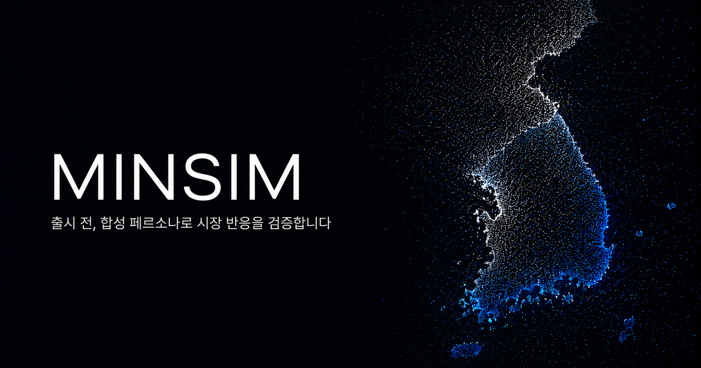
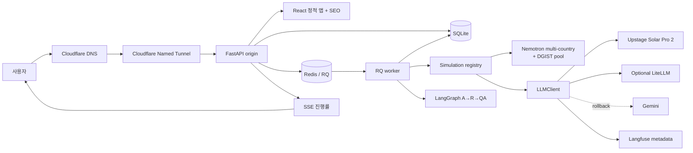
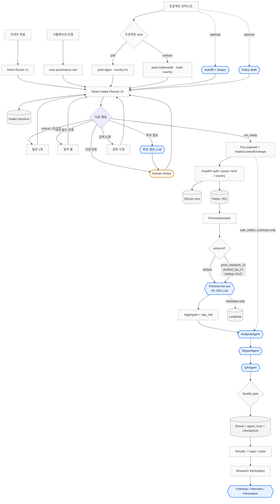

# minsim



minsim은 AI 페르소나 행동 시뮬레이션 제품입니다.  
NVIDIA Nemotron Personas(한국 기본, 10개국 지원), provider-neutral LLM 라우팅, React + FastAPI 앱 표면을 기반으로 합니다.

공개 리포: [minsim-ai/minsim](https://github.com/minsim-ai/minsim)

## 한 줄 요약

팀이 출시 전에 가격·제품·마케팅·캠퍼스 정책 반응을 **합성 페르소나**로 미리 검증하도록 돕습니다. 기본 시장은 한국이며, venture 프로젝트는 다국가 페르소나 풀을 선택할 수 있습니다.

데모가 증명해야 할 한 가지:

> 사용자는 `arabesque.cc` 랜딩을 보고, `/app`에 로그인한 뒤, 프로젝트 종류(poll/venture)와 시뮬레이션을 선택하고, 실시간 진행을 보며, 표본·품질 맥락이 있는 신뢰 가능한 결과와 Research Workspace를 확인한다.

## 현재 결정

| 항목 | 내용 |
| --- | --- |
| 공개 도메인 | `https://arabesque.cc` |
| 외부 데모 스택 | React 프론트엔드 + FastAPI 백엔드 |
| 터널 | Cloudflare Named Tunnel → FastAPI origin |
| 인증 | 랜딩/상태/SEO 경로는 공개. `/app*`, `/projects*`, `/results*`, `/connect`, `/admin` 및 run/project/intake/export API는 Google OAuth 세션 필요 (설정 시). E2E용 test-login은 기본 비활성 |
| 무료 실행권 | 기본 무제한 (`KORESIM_FREE_RUN_LIMIT=0`). 양수면 계정별 상한 강제. admin/bypass 이메일은 env로 설정 |
| 프로젝트 종류 | `poll`(여론/캠퍼스, 기본 `dgist` 풀·한국만) · `venture`(사업 검증, 기본 `nationwide`·다국가 가능). 서버 `kind_policy`가 sim/country 조합을 강제 |
| 시뮬레이션 | 등록 13종: Phase 5 시장 9종 + `startup_item_validation` + `campus_policy` / `campus_priority` / `open_survey` |
| 페르소나 | 국가 10개 (`kr` 기본, `us` `jp` `in` `br` `fr` `sg` `vn` `sv` `be`) · 풀 `nationwide` / `dgist` |
| 영속화 | SQLite job/result store · intake sessions · projects · agent_runs · checkpoints |
| 작업 큐 | Redis + RQ worker |
| 진행률 | SSE + polling fallback |
| Remote MCP | `https://arabesque.cc/mcp` + 앱 `/connect` — OAuth 2.1 PKCE Bearer (Cursor/Claude Desktop). 공유 Bearer 키 폐기. 세션 쿠키는 same-origin fallback |
| 신뢰 계층 | quality, sample summary, seed, disclaimer를 공통 result schema에 포함. 결과 UI에 segment radar·다국가 지도·Research Workspace |
| LLM | 운영: Upstage `solar-pro2`. Gemini는 명시적 rollback. Ollama runtime fallback 없음. Langfuse는 metadata-only |
| Intake | **React planner v3**가 정책 source of truth → provenance slot → `IntakeContextEnvelope` / `safe_intake_summary`. 서버 `/api/intake/advance`는 legacy only |
| 데이터 거버넌스 | 제품 저장소의 `raw_results`와 외부 provider/observability payload를 분리 (기본 metadata-only) |
| UI 테마 | 라이트 기본. 헤더 토글로 dark 저장(`minsim.theme`). OS `prefers-color-scheme` 추종 안 함 |

## 아키텍처

배포·런타임 경계:



제품 데이터 평면(요약):

| 레이어 | 역할 |
| --- | --- |
| React V2 shell | 프로젝트 · intake · loading · results · Research Workspace · `/connect` · `/admin` |
| FastAPI | auth, quota, kind/country gate, intake session 영속, run/SSE/export, admin analytics |
| RQ worker | 표본 → 페르소나 fan-out → envelope → result agents → checkpoints |
| LLMClient | Solar 운영 라우팅, rate-limit backoff, metadata-only Langfuse |

Remote MCP(`/mcp`, OAuth)는 위 조립 라인과 별도 표면이다. 도구 목록은 [Remote MCP](#remote-mcp) 를 본다.

## Agentic 워크플로

minsim은 “하나의 자유형 자율 agent가 전부 처리”하는 구조가 **아닙니다**.

| 구간 | 무엇 | Agent? |
| --- | --- | --- |
| **0. Project** | `poll` / `venture` 컨텍스트 저장. 선택적 autofill(Serper) · policy-draft | 보조 LLM only |
| **1. Intake** | React planner v3: critical 질문/폼, 가정 human review | 후보 생성 LLM (선택) |
| **2. Simulation** | RQ + async batch가 50~200 페르소나 fan-out (필요 시 versioned protocol) | Persona fan-out (LangGraph **아님**) |
| **3. Result agents** | 집계 후 LangGraph `Analysis → Report → QA` | 소량 LLM |
| **4. Post-run** | Research Workspace: cohort follow-up · interview · persuasion · redacted export | 대화형 LLM |

프로젝트 저장만으로는 실행되지 않습니다. **종류 선택 → 시뮬레이션 유형 → intake → 실행** 후에 run history에 결과가 쌓입니다.

### 워크플로 문서

| 문서 | 용도 |
| --- | --- |
| **[요약 (brief)](docs/design/agentic-workflow-brief.md)** | 구간·도형 범례·한 페이지 요약 |
| **[상세 (deep)](docs/design/agentic-workflow-deep.md)** | `run_ready` 이후 순서, 가정 검토, 데이터 경계, 실패 모드 |

### 도형 범례

| 도형 | 의미 |
| --- | --- |
| **육각** `{{}}` | **Agent** (LLM 역할 — 파란 강조) |
| 마름모 `{}` | 분기 / 정책 결정 |
| 트랙 `([" "])` | Human review |
| 원통 `[(" ")]` | 저장소 / 큐 |
| 사각 `[" "]` | 일반 시스템 단계 |



### Planner 행동 (요약)

V2 제품 경로: **`intake-planner:v3-20260713`** (React `frontend/src/intake/planner.ts`)  
서버 `src/intake/engine.py`의 `intake-planner:v2-*` 와 `/api/intake/advance` 는 **deprecated 호환**만.  
공통 기본값 `sample_size=200`, `seed=42`.

| action | 의미 |
| --- | --- |
| `ask_question` | critical slot 하나 질문 |
| `show_form` | 여러 structured field 일괄 입력 |
| `candidate_review` | Creative 후보·가정 검토 (human) |
| `confirm_assumptions` | 생성·추론 가정 승인 (human) |
| `repair_input` | 잘못된 입력 수정 |
| `run_ready` | 검증 가능한 run payload 생성 |

### Versioned protocol (선택)

| Protocol | 부모 simulation | 설명 |
| --- | --- | --- |
| `price_research_v2` | `price_optimization` | 가격 사다리·거절 조건 등 multi-step + calibration |
| `product_qa_v1` | `value_proposition` | 제품 artifact 순위 평가 |
| `startup_item_validation_v1` / `v2` | `startup_item_validation` | multi-call vs 단일 structured JSON(+repair). env `STARTUP_ITEM_VALIDATION_PROTOCOL_VERSION` |

### 누가 Agent인가

| 구성 | 다이어그램 | LLM |
| --- | --- | --- |
| React Intake Planner | 사각 (control plane) | 기본 없음 |
| Autofill / policy-draft / 후보 생성 | **육각 Agent** | 있음 · human review 또는 rate limit |
| Persona fan-out 50~200 | **육각 Agent** (RQ, LangGraph 아님) | 대량 |
| Analysis → Report → QA | **육각 Agent** (LangGraph `result-agent-workflow/v1`) | 소량 · 실패 시 deterministic fallback |
| Followup / Interview / Persuasion | **육각 Agent** (run 이후) | 대화형 · 소표본 |
| SQLite / Redis / FastAPI / kind gate | 원통·사각 | 없음 |

미검토 가정 있으면 FastAPI가 run을 거부합니다.  
Result agent 입력은 집계 지표 + `safe_intake_summary` only (raw persona/채팅 전문 기본 제외).  
오케스트레이션 실패는 run 전체를 실패시키지 않고 degrade + quality 강등할 수 있습니다.

구현 진입점과 전체 시퀀스는 **[상세 문서](docs/design/agentic-workflow-deep.md)** 를 보세요.

## 저장소 구조

```text
.
├── README.md
├── AGENTS.md                 # 공개용 에이전트 가이드
├── frontend/                 # React / Vite UI (V2 shell, maps, SEO public)
├── src/                      # FastAPI · simulations · orchestration · MCP · OAuth
├── scripts/                  # verify, worker, local checks
├── docs/                     # 공개 설계 · 기능 명세
├── evals/                    # deterministic fixture
├── tests/                    # pytest
├── data/                     # 로컬 parquet only (Git 제외)
├── pyproject.toml
└── .env.example              # 시크릿 placeholder only
```

로컬 시크릿(`.env`), parquet 데이터셋, `.venv`, `frontend/node_modules` / `dist`, 검증 덤프, 머신별 deploy 설정은 Git에 올리지 않습니다.

## 로드맵 요약

| Phase | 상태 | 핵심 |
| --- | --- | --- |
| 0 코어 MVP | 완료 | loader, sampler, simulator, Creative Testing |
| 1 React+FastAPI+Tunnel | 완료 | 단일 origin, SQLite, RQ, SSE, `arabesque.cc` |
| 2 안정성 | 완료 | timeout/retry, partial result, refresh 복구 |
| 3 경로/인증 정책 | 완료 | Access 비활성 + 앱 레벨 Google OAuth |
| 4 데모·신뢰 계층 | 완료 | preset, quality/sample/disclaimer |
| 5 시뮬레이션 확장 | 완료 | 시장 9종 + 공통 envelope |
| 6 디자인 동기화 | 완료 | FE/BE 스키마 패리티 |
| 7 LLM Gateway · Agent | 완료(코드·Solar live gate) | Solar Pro 2, LangGraph A→R→QA, MCP OAuth + /connect |

**Post-demo product surface (배포됨, 코드 기준):**

- 시뮬레이션 13종 (startup + campus_policy/priority + open_survey)
- 프로젝트 kind `poll` / `venture` + DGIST 풀
- 다국가 페르소나 10개국 + 결과 지도
- versioned protocol (`price_research_v2`, `product_qa_v1`, startup v1/v2)
- Research Workspace (followup / interview / persuasion)
- segment reaction radar · admin analytics · SEO 공개 페이지 · light/dark 토글

이후: release 운영, MCP Streamable HTTP hardening, 제품 polish.

## 개발 규칙

1. 공개 설계/기능 문서(`docs/design/`, `docs/functional/`)와 코드 계약을 먼저 확인합니다.
2. 외부 데모는 FastAPI 단일 origin (API + React build).
3. 모든 결과에 seed · sample · quality · disclaimer를 포함합니다.
4. 시뮬레이션 모듈에서 provider SDK를 직접 import하지 않습니다 (`LLMClient` 경유).
5. 새 simulation/kind/country 조합은 `src/simulations/kind_policy.py`와 FE `projectKinds`를 함께 갱신합니다.
6. 시크릿은 `.env` / secret manager에만 둡니다. Git·문서·프론트 번들에 넣지 않습니다.
7. 검증 덤프, Playwright 결과, 로컬 에이전트 세션, 머신별 deploy 설정은 커밋하지 않습니다.

## 검증

```bash
uv run python scripts/verify.py
```

포함 항목:

- Ruff lint
- deterministic eval fixture
- pytest (백엔드 coverage 임계값 85%)
- FE/BE 스키마 패리티
- frontend eslint / typecheck / production build

빠른 로컬 루프:

```bash
uv run python scripts/verify.py --skip-build
```

## 로컬 실행

사전 조건:

1. 페르소나 parquet 존재 — 최소 `data/personas/kr/nemotron_personas.parquet` 또는 legacy `data/nemotron_korea_personas.parquet`  
2. Redis (`REDIS_URL`, 기본 `redis://localhost:6379/0`)  
3. 외부 LLM 키 (`UPSTAGE_API_KEY` 권장; rollback 시 `GEMINI_API_KEY`)  
4. `frontend/dist` 빌드  

```bash
# 준비 상태
uv run python scripts/check_local_services.py

# 데이터 · 프론트
uv run python scripts/download_dataset.py
cd frontend && npm install && npm run build && cd ..

# 터미널 3개
redis-server
uv run python scripts/run_worker.py
uv run uvicorn src.api.main:app --host 127.0.0.1 --port 8000
```

확인:

```bash
curl http://127.0.0.1:8000/api/health
# 브라우저: http://127.0.0.1:8000/app
```

환경 변수 템플릿: [`.env.example`](.env.example)

## 배포 개요

프로덕션 데모는 Cloudflare Tunnel 등으로 로컬/프라이빗 origin을 공개 도메인에 연결하는 형태로 운영할 수 있습니다.  
머신별 경로, launchd, tunnel credential, 운영 runbook은 **이 공개 리포에 포함하지 않습니다**. 배포 시크릿은 로컬 환경 또는 secret manager에만 두세요.

일반적인 업데이트 흐름:

```bash
npm --prefix frontend run build
# restart your API + RQ worker processes
# optional: uv run python scripts/check_local_services.py
```

## Remote MCP

엔드포인트:

```text
https://arabesque.cc/mcp
```

앱 연결 페이지 (헤더 **MCP**):

```text
https://arabesque.cc/connect
```

웹 앱과 동일한 프로젝트 서비스, ownership, 큐, quota, redacted export를 사용합니다.  
Connect UI: `GET /api/mcp/connect`, grant 철회: `GET/DELETE /api/mcp/grants`.

### 인증 경계

- `UPSTAGE_API_KEY`는 **서버 전용** provider 키입니다. MCP 클라이언트에 주지 마세요.
- 공유 Bearer MCP 키는 폐기되었습니다.
- **Cursor / Claude Desktop**은 first-party OAuth 2.1 (PKCE)로 발급된
  audience-bound Bearer 토큰(`scope=koresim:mcp`, resource=`{base}/mcp`)을 사용합니다.
- 브라우저 same-origin 호출은 Google 로그인 세션 쿠키 fallback을 유지합니다.
- Discovery:
  - `/.well-known/oauth-protected-resource`
  - `/.well-known/oauth-authorization-server`
  - `POST /oauth/register` (public client DCR)

### Cursor / Claude Desktop 연결

1. `https://arabesque.cc/connect`에서 Google 로그인
2. Cursor 또는 Claude Desktop 설정 스니펫 복사 (URL 중심, OAuth는 호스트가 수행)
3. 호스트가 연 브라우저 consent에서 승인
4. 같은 페이지에서 grant 철회 가능

### 비인증 확인 (401 기대)

```bash
curl -i https://arabesque.cc/mcp \
  -H 'Content-Type: application/json' \
  -H 'Accept: application/json, text/event-stream' \
  --data '{
    "jsonrpc": "2.0",
    "id": "init-1",
    "method": "initialize",
    "params": {
      "protocolVersion": "2025-11-25",
      "capabilities": {},
      "clientInfo": {"name": "minsim-readme", "version": "1.0"}
    }
  }'
```

### 도구 목록 (현재 코드 식별자)

> 제품명은 minsim입니다. MCP tool 식별자는 아직 `koresim.*` 접두사를 사용합니다 (후속 정리 예정).

- `koresim.list_projects`
- `koresim.create_project`
- `koresim.get_project`
- `koresim.list_project_runs`
- `koresim.create_project_run`
- `koresim.export_run`
- `koresim.submit_feedback`
- `koresim.ask_followup`
- `koresim.ask_interview`

Resources 예: `koresim://projects`, `koresim://projects/{id}`.  
Prompt: `koresim-result-review`.  
Export는 `raw_results`를 반환하지 않습니다.  
MCP 설계 개요: `docs/design/mcp-server-integration.md`.

## 공통 API

공개(auth 설정 시에도):

```text
GET  /health
GET  /api/health
GET  /api/config          # sample limits, countries, pools, sim types
GET  /api/auth/*
```

세션 필요(대표 경로, V2 제품 표면):

```text
GET  /api/me/usage
GET  /api/presets

POST /api/projects
GET  /api/projects
GET  /api/projects/{id}
POST /api/projects/{id}/runs

POST /api/intake/sessions
GET  /api/intake/sessions/{id}
POST /api/intake/candidates
POST /api/intake/autofill
POST /api/intake/policy-draft
# POST /api/intake/advance   — deprecated

POST /api/runs
POST /api/runs/{run_id}/cancel
GET  /api/runs/{run_id}
GET  /api/runs/{run_id}/events
GET  /api/runs/{run_id}/result
GET  /api/runs/{run_id}/export
GET  /api/runs/{run_id}/partials
POST /api/runs/{run_id}/feedback

# Research Workspace (project-scoped)
POST /api/projects/{id}/runs/{run_id}/followup
POST /api/projects/{id}/runs/{run_id}/persuasion
POST /api/projects/{id}/runs/{run_id}/interview
GET|POST .../interview-threads

# Admin (KORESIM_ADMIN_EMAILS)
GET  /api/admin/overview
GET  /api/admin/users
GET  /api/admin/runs
GET  /api/admin/feedback
GET  /api/admin/export
POST /api/admin/retention/prune
```

Run 수명주기:

```text
queued → running → completed
queued → running → failed
queued → running → canceled
queued → running → interrupted
```

등록 simulation_type:

```text
creative_testing, price_optimization, product_launch, value_proposition,
market_segmentation, competitive_positioning, brand_perception,
churn_prediction, campaign_strategy, startup_item_validation,
campus_policy, campus_priority, open_survey
```

결과 envelope 공통 필드:

- `run_id`, `simulation_type`, `seed`, `target_filter`, `country_id` / persona pool 맥락
- `sample_summary`, `quality`, `warnings`, optional `protocol`
- simulation별 metrics · segments · insights · orchestration
- (보호 경로) `raw_results` — 외부 export에서는 제외

## 참고 문서

| 문서 | 용도 |
| --- | --- |
| [`docs/design/agentic-workflow-brief.md`](docs/design/agentic-workflow-brief.md) | Agentic 워크플로 **요약** |
| [`docs/design/agentic-workflow-deep.md`](docs/design/agentic-workflow-deep.md) | Agentic 워크플로 **상세** |
| `docs/design/llm-gateway-orchestration.md` | LLM / agent 경계 |
| `docs/design/data-governance-and-io-boundary.md` | raw vs metadata 정책 |
| `docs/design/evaluation-framework.md` | eval gate |
| `docs/design/persona-simulation-protocol-engine.md` | versioned protocol |
| `docs/design/mcp-server-integration.md` | MCP / OAuth |
| `docs/functional/` | 시뮬레이션 기능 명세 |
| `AGENTS.md` | 코딩 에이전트 가이드 (공개용) |

## 데이터

- 기본: [NVIDIA Nemotron-Personas-Korea](https://huggingface.co/nvidia/Nemotron-Personas-Korea) (CC BY 4.0)
- 다국가: `data/personas/{kr,us,jp,in,br,fr,sg,vn,sv,be}/nemotron_personas.parquet` (`src/data/datasets.py`)
- 캠퍼스 풀: `dgist` → `data/dgist_personas.parquet` (poll 기본)
- 로컬 parquet은 Git에 포함하지 않습니다. `scripts/download_dataset.py`로 준비하세요.

## 라이선스

이 리포의 `LICENSE` 파일을 따릅니다.
