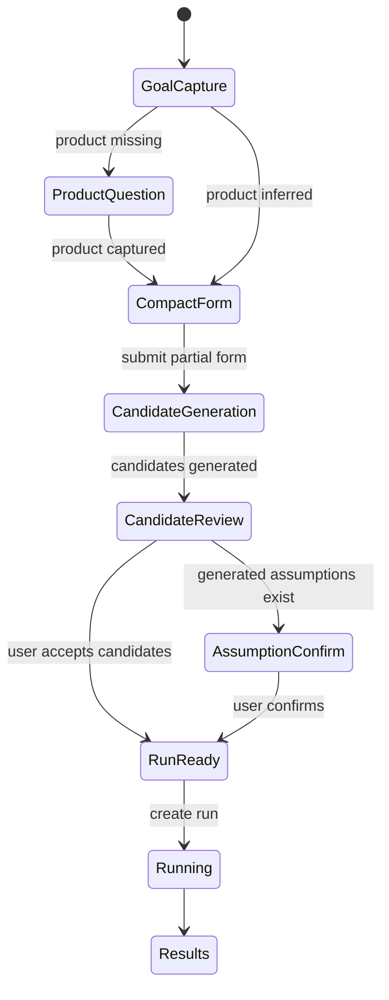

# Creative Testing Intake v1

## 1. Why Creative Testing First

`creative_testing` is the best first target for the agentic intake layer because users often arrive with an outcome, not with finished candidates.

Common real starts:

- "상세페이지 헤드라인을 만들고 싶어요."
- "광고 카피 뭐가 좋을지 보고 싶어요."
- "신제품 런칭 문구를 테스트하고 싶어요."
- "블로그 프로그램을 팔 건데 메인 문구가 고민이에요."

The existing simulation requires `creatives: string[]`, but a real user may not have any creatives yet. Therefore this intake flow must support both:

1. user supplies candidate creatives.
2. system generates candidate creatives, user reviews them, then simulation runs.

## 2. Target User Story

```text
User:
제 상품 상세페이지 헤드라인을 만들고 싶어요.

Assistant:
좋아요. 어떤 제품인가요?

User:
블로그를 작성하는 소프트웨어예요. 윈도우 프로그램이고요.

Assistant:
헤드라인 후보를 만들고 반응을 시뮬레이션하려면 아래 정보가 있으면 좋습니다.
아는 만큼만 채워주세요. 비워둔 항목은 제가 추정하겠습니다.

[Dynamic form]
- 제품 설명: 블로그를 작성하는 윈도우 프로그램
- 핵심 고객: 
- 가장 큰 장점:
- 경쟁 대안:
- 원하는 톤:

User fills:
핵심 고객: 네이버 블로그로 마케팅하는 소상공인

Assistant:
나머지 고객군은 제가 이렇게 가정하겠습니다.
- 콘텐츠 외주 없이 직접 글을 쓰는 1인 사업자
- 검색 유입을 늘리고 싶은 온라인 쇼핑몰 운영자

이 가정으로 헤드라인 후보 4개를 만들었습니다. 수정하거나 그대로 진행할 수 있습니다.

[Candidate cards]
```

## 3. Task Frame

```json
{
  "taskId": "creative_testing.headline_generation_and_test",
  "userGoal": "상품 상세페이지 헤드라인을 만들고 싶다",
  "decisionQuestion": "어떤 헤드라인이 핵심 고객에게 가장 설득력 있는가?",
  "likelySimulationTypes": ["creative_testing", "value_proposition"],
  "primarySimulationType": "creative_testing",
  "preSimulationActions": ["generate_creative_candidates"],
  "confidence": 0.82
}
```

## 4. Slot Schema

| Slot | Importance | Source policy | Notes |
| --- | --- | --- | --- |
| `creative_surface` | critical | inferable | headline, ad copy, landing hero, detail page, push message, etc. |
| `product_description` | critical | ask if missing | Must know what is being sold or communicated. |
| `creative_candidates` | critical | user or generated | Existing backend needs 2-10 creatives. |
| `candidate_generation_allowed` | critical when candidates missing | ask or infer from request | If user asks "만들고 싶다", generation is allowed. |
| `target_customers` | recommended | user, inferred, or generated | Ask for 1; generate remaining if needed. |
| `main_benefit` | recommended | user or generated | Needed for good candidate generation. |
| `pain_points` | recommended | user or generated | Useful for message angles. |
| `differentiators` | recommended | user or generated | Prevents generic copy. |
| `competitor_alternatives` | recommended | user or generated | Helps positioning. |
| `tone` | optional | default | professional, friendly, direct response, premium, etc. |
| `channel_context` | optional | inferable | detail page, Naver ad, Instagram, etc. |
| `target_filter` | optional | default or parse | Maps to persona sampling. |
| `sample_size` | optional | default | Clamp to backend limit. |
| `seed` | optional | default | Reproducibility. |

## 5. Planner Rules

### Rule A — Product Missing

If the user asks for copy/headlines but gives no product:

```text
Ask: "좋아요. 어떤 제품이나 서비스인가요?"
```

Do not show a full form yet. One direct question is lower effort.

### Rule B — Product Present, Audience Missing

If `product_description` exists but `target_customers` is missing:

Render a compact form with product prefilled and audience highlighted.

```json
{
  "type": "show_form",
  "message": "아는 만큼만 채워주세요. 핵심 고객은 1개만 적어도 괜찮습니다.",
  "form": {
    "id": "creative_testing_headline_intake_v1",
    "fields": [
      {
        "id": "product_description",
        "label": "제품 설명",
        "type": "textarea",
        "required": true,
        "value": "블로그를 작성하는 윈도우 프로그램"
      },
      {
        "id": "target_customers",
        "label": "핵심 고객",
        "type": "multi_text",
        "minItems": 1,
        "recommendedItems": 3,
        "allowAutoFill": true
      },
      {
        "id": "main_benefit",
        "label": "가장 큰 장점",
        "type": "textarea",
        "required": false,
        "allowAutoFill": true
      },
      {
        "id": "tone",
        "label": "원하는 톤",
        "type": "single_select",
        "required": false,
        "options": ["전문적", "친근함", "전환 중심", "프리미엄", "SEO 중심"]
      }
    ],
    "primaryAction": "다음"
  }
}
```

### Rule C — User Provides One Audience

If user provides one target customer where three are recommended:

- Keep the user-provided target as high-confidence.
- Generate two additional audience hypotheses.
- Mark them `generated`, `needsUserReview: true`.
- Continue unless the assumption risk is high.

Example:

```json
[
  {
    "slotId": "target_customers",
    "value": "네이버 블로그로 마케팅하는 소상공인",
    "source": "user",
    "confidence": 0.95,
    "needsUserReview": false
  },
  {
    "slotId": "target_customers",
    "value": "콘텐츠 외주 없이 직접 글을 쓰는 1인 사업자",
    "source": "generated",
    "confidence": 0.76,
    "needsUserReview": true
  },
  {
    "slotId": "target_customers",
    "value": "검색 유입을 늘리고 싶은 온라인 쇼핑몰 운영자",
    "source": "generated",
    "confidence": 0.72,
    "needsUserReview": true
  }
]
```

### Rule D — Candidate Creatives Missing

If `creative_candidates` is missing and `candidate_generation_allowed` is true:

Generate 3-5 candidates and render editable cards.

Candidate generation should vary message angle, not only wording:

| Angle | Purpose |
| --- | --- |
| outcome | The concrete result the customer wants. |
| pain relief | The problem the customer wants to stop experiencing. |
| automation | The job the software removes or compresses. |
| differentiation | Why this is better than manual writing or generic AI chat. |
| trust | Proof, control, or professionalism. |

### Rule E — Ready to Run

Run when:

- `product_description` exists.
- `creative_candidates.length` is between 2 and 10.
- generated high-impact assumptions have either been confirmed or shown with a "continue" action.
- payload validation passes.

## 6. Candidate Generation Prompt Contract

The model should return structured candidates, not prose.

```json
{
  "candidates": [
    {
      "id": "headline_a",
      "text": "블로그 글쓰기, 이제 초안부터 발행까지 한 번에",
      "angle": "automation",
      "why": "윈도우 프로그램의 생산성 이점을 직접적으로 전달"
    }
  ],
  "assumptions": [
    {
      "slotId": "main_benefit",
      "value": "블로그 작성 시간을 줄이고 검색 유입용 글을 더 쉽게 만든다",
      "confidence": 0.74
    }
  ]
}
```

Initial candidate constraints:

- 3-5 candidates.
- Korean copy.
- 40 characters or less for headline surface unless user asks otherwise.
- Avoid unverifiable claims such as "1위", "100%".
- Each candidate should represent a different strategic angle.

## 7. Final Run Payload

After review, convert to existing API payload:

```json
{
  "simulation_type": "creative_testing",
  "input": {
    "creatives": [
      "블로그 글쓰기, 이제 초안부터 발행까지 한 번에",
      "소상공인을 위한 검색 노출형 블로그 작성 프로그램",
      "글감 고민 없이, 윈도우에서 바로 완성하는 마케팅 블로그"
    ]
  },
  "sample_size": 200,
  "target_filter": {
    "province": ["서울", "경기"]
  },
  "seed": 42
}
```

Future payload metadata should include:

```json
{
  "intake_summary": {
    "user_goal": "상품 상세페이지 헤드라인 생성 및 검증",
    "user_provided": {
      "product_description": "블로그를 작성하는 소프트웨어. 윈도우 프로그램.",
      "target_customers": ["네이버 블로그로 마케팅하는 소상공인"]
    },
    "generated": {
      "target_customers": [
        "콘텐츠 외주 없이 직접 글을 쓰는 1인 사업자",
        "검색 유입을 늘리고 싶은 온라인 쇼핑몰 운영자"
      ],
      "creative_candidates": ["..."]
    }
  }
}
```

## 8. UI States



## 9. Example Conversation

```text
User:
제 상품 상세페이지 헤드라인을 만들고 싶어요.

Assistant:
좋아요. 어떤 제품이나 서비스인가요?

User:
블로그를 작성하는 소프트웨어예요. 윈도우 프로그램이고요.

Assistant:
좋습니다. 헤드라인 후보를 만들고 반응을 시뮬레이션하려면 핵심 고객과 장점이 있으면 더 정확합니다.
아는 만큼만 채워주세요. 비워둔 항목은 제가 추정하겠습니다.

Form:
제품 설명: 블로그를 작성하는 소프트웨어. 윈도우 프로그램.
핵심 고객: [네이버 블로그로 마케팅하는 소상공인]
가장 큰 장점: []
원하는 톤: [전환 중심]

Assistant:
입력하신 고객 외에 아래 두 고객군도 함께 가정하겠습니다.
- 콘텐츠 외주 없이 직접 글을 쓰는 1인 사업자
- 검색 유입을 늘리고 싶은 온라인 쇼핑몰 운영자

이 기준으로 헤드라인 후보를 만들었습니다.

Candidates:
A. 블로그 글쓰기, 이제 초안부터 발행까지 한 번에
B. 소상공인을 위한 검색 노출형 블로그 작성 프로그램
C. 글감 고민 없이, 윈도우에서 바로 완성하는 마케팅 블로그
D. 직접 쓰는 사장님을 위한 블로그 작성 파트너

Assistant:
이 4개를 200명 페르소나에게 보여주고 어떤 헤드라인이 더 설득력 있는지 시뮬레이션할까요?
```

## 10. Evaluation Scenarios

Create at least these fixture categories:

| Scenario | Expected behavior |
| --- | --- |
| User has only goal | Ask product question. |
| User has goal + product | Show compact form. |
| User has product + one audience | Generate remaining assumptions. |
| User already has 3 headlines | Skip generation, ask target/audience if missing. |
| User says "알아서 해줘" | Generate assumptions and show confirmation. |
| User gives too many headlines | Ask to select or automatically reduce to 10 with review. |
| User asks for image/video creative | Explain current text-only limitation and adapt to text copy if possible. |

## 11. First Implementation Cut

Minimum useful implementation:

- Add `creativeTestingIntakeSchema`.
- Add planner action:
  - `ask_question`
  - `show_form`
  - `generate_candidates`
  - `confirm_assumptions`
  - `run_simulation`
- Add dynamic form renderer.
- Add candidate review cards.
- Convert accepted candidates to existing `buildRunPayload`.

Do not wait for all 9 simulations before proving this flow.
