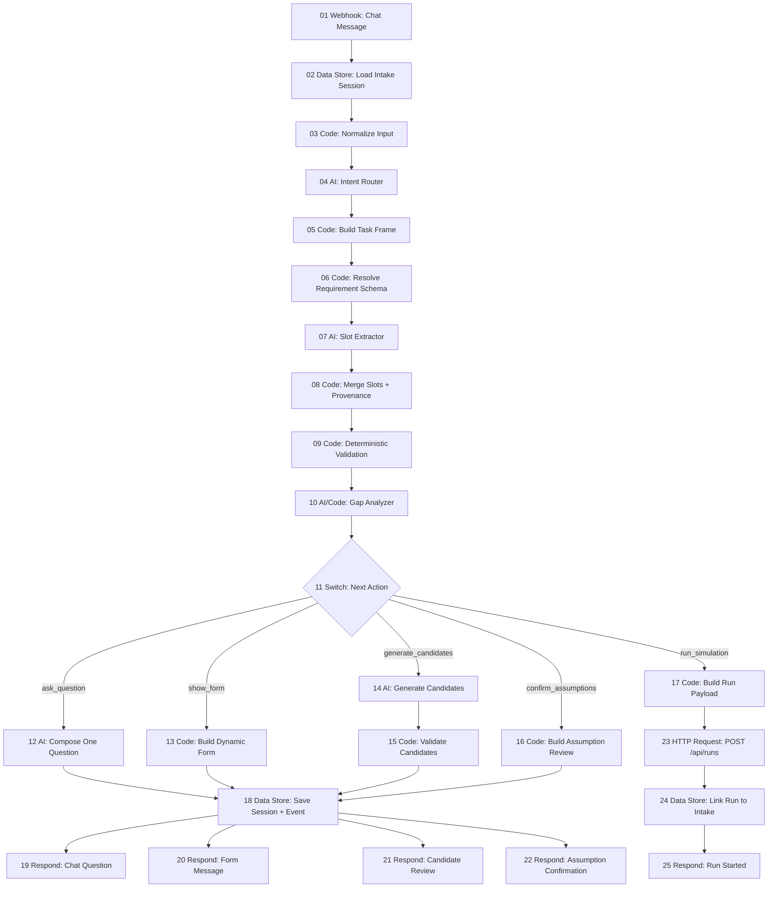
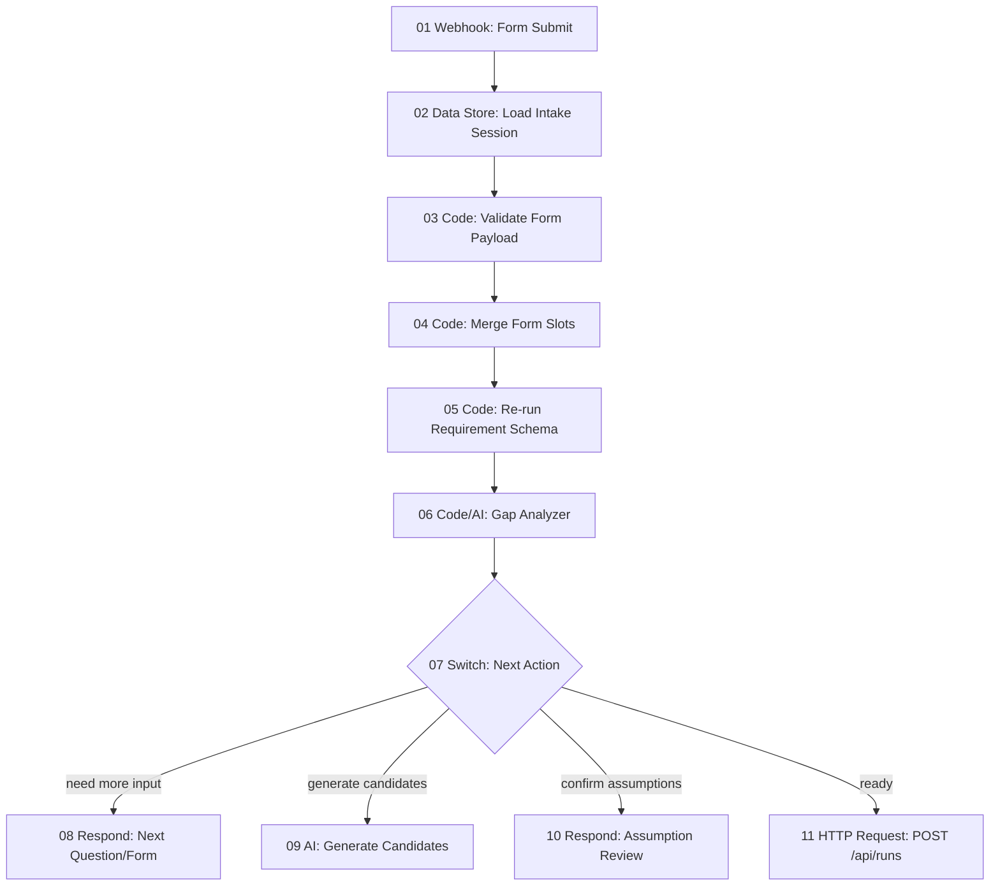
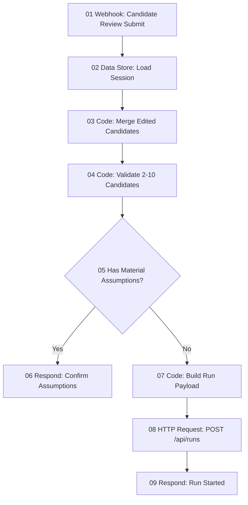

# n8n Node Algorithm for Agentic Intake

This document maps the universal agentic intake workflow into n8n-style nodes.

The product does not need to run n8n in production. This node graph is useful as:

- a prototype workflow.
- a product algorithm sketch.
- an implementation checklist for a FastAPI/LangGraph version.
- a QA artifact for "what should happen next?" behavior.

## 1. Top-Level Chat Workflow



## 2. Form Submit Workflow



## 3. Candidate Review Workflow



## 4. Node Contracts

| Node | Type | Input | Output | Responsibility |
| --- | --- | --- | --- | --- |
| 01 Webhook: Chat Message | Webhook | `{session_id?, message}` | raw event | Receives user text. |
| 02 Load Intake Session | Data Store | session id | session | Loads prior messages, slots, task frame. |
| 03 Normalize Input | Code | raw message | normalized message | Trim, classify empty input, attach locale/time. |
| 04 Intent Router | AI Agent | normalized message + session | candidate task frame | Detects user goal and likely simulation types. |
| 05 Build Task Frame | Code | router output | validated task frame | Applies thresholds and safe defaults. |
| 06 Resolve Requirement Schema | Code | task frame | slot requirements | Selects universal + simulation-specific slots. |
| 07 Slot Extractor | AI Agent | message + requirements | structured slot deltas | Extracts product, audience, options, constraints. |
| 08 Merge Slots | Code | old slots + deltas | slots with provenance | Preserves source, confidence, evidence. |
| 09 Deterministic Validation | Code | slots | field errors/warnings | Checks required types and backend limits. |
| 10 Gap Analyzer | AI/Code | task frame + slots | next action recommendation | Combines missingness, confidence, and UX policy. |
| 11 Switch | Switch | next action | branch | Routes to question/form/generation/run. |
| 12 Compose One Question | AI Agent | highest-priority gap | assistant question | Generates one clear question. |
| 13 Build Dynamic Form | Code | recommended gaps | form schema | Produces renderable form JSON. |
| 14 Generate Candidates | AI Agent | slots + candidate spec | candidates | Generates/editable options before simulation. |
| 15 Validate Candidates | Code | candidates | valid candidates/errors | Enforces count, length, non-empty, diversity checks. |
| 16 Build Assumption Review | Code | generated/inferred slots | review payload | Groups assumptions by impact. |
| 17 Build Run Payload | Code | task frame + slots | `/api/runs` body | Converts intake state to existing API contract. |
| 23 POST /api/runs | HTTP Request | run payload | run id | Starts simulation. |
| 24 Link Run to Intake | Data Store | run id + session | persisted link | Enables report provenance. |

## 5. AI Node Prompts

### 5.1 Intent Router Prompt Shape

```text
You classify a KoreaSim user request into a task frame.

Return JSON only:
{
  "userGoal": string,
  "decisionQuestion": string,
  "likelySimulationTypes": string[],
  "primarySimulationType": string | null,
  "preSimulationActions": string[],
  "confidence": number,
  "evidence": string[]
}

Available simulations:
- creative_testing
- price_optimization
- product_launch
- value_proposition
- market_segmentation
- competitive_positioning
- brand_perception
- churn_prediction
- campaign_strategy

Rules:
- If user wants to create copy/headlines/messages and test them, primary is creative_testing.
- If options are missing but can be generated, add generate_creative_candidates.
- Do not invent product facts; mark low confidence when missing.
```

### 5.2 Slot Extractor Prompt Shape

```text
Extract only facts present in the user message or strongly implied by the conversation.

Return JSON:
{
  "slotDeltas": [
    {
      "slotId": string,
      "value": unknown,
      "source": "user" | "inferred",
      "confidence": number,
      "evidence": string
    }
  ]
}

Do not generate missing values here.
Do not ask questions here.
```

### 5.3 Candidate Generator Prompt Shape

```text
Generate candidates for a simulation input.

Return JSON:
{
  "candidates": [
    {
      "text": string,
      "angle": string,
      "why": string
    }
  ],
  "assumptions": [
    {
      "slotId": string,
      "value": unknown,
      "confidence": number,
      "impact": "low" | "medium" | "high"
    }
  ]
}

Rules:
- Generate 3-5 candidates unless the schema says otherwise.
- Make candidates meaningfully different in strategy, not just wording.
- Avoid unverifiable superlatives.
- Keep Korean copy natural.
```

## 6. Switch Logic

```ts
if (criticalMissing.length > 0) {
  return "ask_question";
}

if (recommendedMissing.length >= 2 && turnCount <= 2) {
  return "show_form";
}

if (needsCandidates && candidateGenerationAllowed) {
  return "generate_candidates";
}

if (materialAssumptions.length > 0 && !assumptionsConfirmed) {
  return "confirm_assumptions";
}

if (payloadValid) {
  return "run_simulation";
}

return "repair_input";
```

## 7. n8n Data Store Shape

```json
{
  "sessionId": "intake_123",
  "status": "collecting",
  "messages": [
    {
      "role": "user",
      "content": "제 상품 상세페이지 헤드라인을 만들고 싶어요."
    }
  ],
  "taskFrame": {
    "primarySimulationType": "creative_testing",
    "preSimulationActions": ["generate_creative_candidates"]
  },
  "slots": [
    {
      "slotId": "creative_surface",
      "value": "상품 상세페이지 헤드라인",
      "source": "inferred",
      "confidence": 0.92,
      "needsUserReview": false
    }
  ],
  "assumptions": [],
  "lastAction": {
    "type": "ask_question",
    "slotIds": ["product_description"]
  }
}
```

## 8. Error Branches

| Error | Branch |
| --- | --- |
| Router confidence too low | Ask broad clarification: "어떤 결정을 돕고 싶으신가요?" |
| Product missing | Ask product question. |
| User provides unsupported media request | Offer text-only adaptation. |
| Too many candidates | Show selection form or trim with review. |
| Candidate validation fails | Regenerate once, then ask user to edit. |
| `/api/runs` rejects payload | Return repair form with invalid fields. |
| LLM node timeout | Fall back to deterministic form for known simulation type. |

## 9. Observability

Log each node as an event:

```json
{
  "eventType": "gap_analyzed",
  "sessionId": "intake_123",
  "taskFrameConfidence": 0.82,
  "criticalMissing": ["product_description"],
  "recommendedMissing": ["target_customers", "main_benefit"],
  "nextAction": "ask_question"
}
```

Useful metrics:

- route confidence distribution.
- number of turns before run.
- form submit completion rate.
- generated candidate acceptance rate.
- assumption confirmation rate.
- run payload rejection rate.

## 10. Production Translation

If this stays inside FastAPI/LangGraph instead of n8n, map nodes as:

| n8n node group | Production module |
| --- | --- |
| Webhook + Respond | FastAPI `/api/intake/*` |
| Data Store | SQLite `intake_sessions`, `intake_events` |
| Intent Router AI | `src/intake/router.py` |
| Requirement Schema | `src/intake/schemas.py` |
| Slot Extractor AI | `src/intake/extractor.py` |
| Gap Analyzer | `src/intake/planner.py` |
| Candidate Generator | `src/intake/generator.py` |
| Run Payload Builder | `src/intake/payloads.py` |

The important boundary is not the runtime. The important boundary is that the product planner owns state, validation, and final execution.
