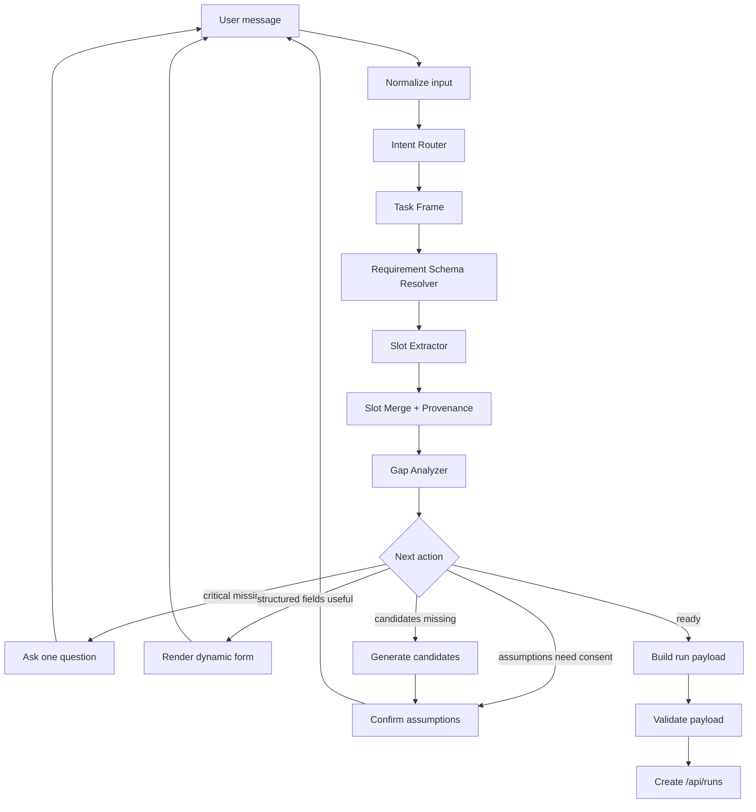

# Universal Agentic Intake Workflow

## 1. Problem

The current app starts from fixed simulation types and fixed `chatSteps`.

That works for a demo, but it is not the product behavior users expect. A real user will usually start with a goal:

- "상세페이지 헤드라인을 만들고 싶어요."
- "새 제품 가격을 얼마로 해야 할지 모르겠어요."
- "이 캠페인이 20대 여성에게 먹힐지 보고 싶어요."
- "우리 브랜드가 경쟁사 대비 어떻게 보이는지 알고 싶어요."

They will not always know whether the right tool is creative testing, value proposition testing, product launch prediction, segmentation, or campaign strategy. KoreaSim needs an agentic intake layer that can convert fuzzy user goals into executable simulation requests.

## 2. Goals

- [ ] Accept natural language goals before simulation type selection.
- [ ] Route the goal to one or more likely simulation types.
- [ ] Maintain a persistent intake session with slots, assumptions, and provenance.
- [ ] Ask one clarifying question when a critical slot is missing.
- [ ] Render dynamic forms when several structured fields can be collected faster than chat.
- [ ] Auto-fill missing recommended fields when the user cannot provide them.
- [ ] Generate candidates before simulation when the simulation needs options but the user has not supplied them.
- [ ] Convert the completed intake session into the existing `/api/runs` payload.
- [ ] Store input provenance so the final report can separate user facts, inferred assumptions, generated candidates, and defaults.

## 3. Non-goals

- Do not build an unconstrained autonomous agent that can run arbitrary actions.
- Do not let the LLM decide final API payload validity without deterministic validation.
- Do not require users to fill every field before proceeding.
- Do not expose model prompts, provider keys, or internal simulation schemas to React.
- Do not replace FastAPI/RQ/SQLite in the first implementation.
- Do not implement all 9 simulation-specific UIs before the common planner exists.

## 4. Research Basis

The design follows a conservative production agent pattern:

- Keep the workflow explicit and inspectable.
- Use LLMs for ambiguous language understanding, extraction, candidate generation, and natural responses.
- Use deterministic code for validation, state merging, routing thresholds, and final payload construction.
- Add human checkpoints before assumptions become run inputs.

Sources reviewed:

- [OpenAI: A practical guide to building AI agents](https://openai.com/business/guides-and-resources/a-practical-guide-to-building-ai-agents/) for agent components, tool boundaries, instructions, and guardrails.
- [Anthropic: Building effective agents](https://www.anthropic.com/engineering/building-effective-agents) for workflow patterns such as routing, prompt chaining, evaluator-optimizer, and orchestrator-workers.
- [LangGraph persistence documentation](https://docs.langchain.com/oss/javascript/langgraph/persistence) for durable state, checkpoints, and human-in-the-loop workflow design.
- [n8n AI Agent node documentation](https://docs.n8n.io/integrations/builtin/cluster-nodes/root-nodes/n8n-nodes-langchain.agent/) for a practical node/tool orchestration mapping.

## 5. Product Principle

The system should behave like a good strategist, not like a form generator.

It should ask:

> "What is the minimum information needed to make this decision responsibly?"

Then it should collect only that information. If the user does not know something, the system may infer or generate it, but those assumptions must be visible in the session and in the final report.

## 6. High-Level Architecture



## 7. Core Concepts

### 7.1 Task Frame

The task frame is the assistant's current understanding of the user's job.

```ts
type TaskFrame = {
  taskId: string;
  userGoal: string;
  decisionQuestion: string;
  likelySimulationTypes: SimulationType[];
  primarySimulationType: SimulationType | null;
  preSimulationActions: PreSimulationAction[];
  confidence: number;
  evidence: string[];
};
```

Example:

```json
{
  "userGoal": "상품 상세페이지 헤드라인을 만들고 싶다",
  "decisionQuestion": "어떤 상세페이지 헤드라인이 핵심 고객에게 가장 설득력 있는가?",
  "likelySimulationTypes": ["creative_testing", "value_proposition"],
  "primarySimulationType": "creative_testing",
  "preSimulationActions": ["generate_creative_candidates"],
  "confidence": 0.82
}
```

### 7.2 Intake Slot

Slots store what the system knows, how it knows it, and how safe it is to use.

```ts
type IntakeSlotValue = {
  slotId: string;
  value: unknown;
  source: "user" | "inferred" | "generated" | "default";
  confidence: number;
  evidence?: string;
  needsUserReview: boolean;
};
```

### 7.3 Slot Requirement

Requirements define what each simulation or pre-simulation action needs.

```ts
type SlotRequirement = {
  slotId: string;
  label: string;
  importance: "critical" | "recommended" | "optional";
  dataType: "text" | "textarea" | "number" | "single_select" | "multi_text" | "target_filter";
  minItems?: number;
  recommendedItems?: number;
  canInfer: boolean;
  canGenerate: boolean;
  validation: {
    minLength?: number;
    maxLength?: number;
    min?: number;
    max?: number;
  };
};
```

### 7.4 Intake Action

The planner returns one action per turn.

```ts
type IntakeAction =
  | { type: "ask_question"; question: string; slotIds: string[] }
  | { type: "show_form"; message: string; form: DynamicFormSchema }
  | { type: "generate_candidates"; message: string; candidateSpec: CandidateGenerationSpec }
  | { type: "confirm_assumptions"; message: string; assumptions: IntakeSlotValue[] }
  | { type: "run_simulation"; payload: RunCreateRequest; assumptions: IntakeSlotValue[] }
  | { type: "repair_input"; message: string; fieldErrors: FieldError[] };
```

## 8. Slot Importance Policy

| Importance | Meaning | User experience |
| --- | --- | --- |
| `critical` | Cannot responsibly run or generate without it. | Ask one direct question. |
| `recommended` | Improves quality but can be inferred or generated. | Show form or ask if many fields are empty. |
| `optional` | Useful refinement, not required. | Default silently or expose under advanced controls. |

Rules:

1. If any critical slot is missing and cannot be confidently inferred, ask one question.
2. If multiple recommended slots are missing, render a form instead of sending many chat questions.
3. If the user gives partial recommended input, generate the rest and mark it as assumptions.
4. If candidates are required for a simulation and missing, generate candidates before running.
5. If generated or inferred slots meaningfully affect the result, confirm them before `/api/runs`.
6. If only optional slots are missing, proceed with defaults and record them.

## 9. Universal Slot Families

Most simulation tasks can be decomposed into these families:

| Slot family | Purpose | Examples |
| --- | --- | --- |
| `goal` | What the user wants to decide or create. | "상세페이지 헤드라인", "가격 결정", "이탈 방지" |
| `object` | Product, brand, campaign, service, or policy being evaluated. | product description, brand name, category |
| `audience` | Who should react. | age, region, job, customer segment |
| `options` | Candidates to compare. | headlines, price points, products, value propositions |
| `context` | Usage, channel, market, timing, purchase situation. | landing page, convenience store, subscription renewal |
| `criteria` | What success means. | click intent, purchase intent, trust, perceived value |
| `constraints` | Budget, tone, price range, legal/compliance, sample limits. | budget, tone, max sample size |
| `run_config` | Simulation execution controls. | sample_size, seed, target_filter |

## 10. Simulation Mapping

| Simulation | Critical slots | Recommended slots | Optional slots |
| --- | --- | --- | --- |
| `creative_testing` | creative surface, product/context, creative candidates or permission to generate | target customers, benefit, tone, channel, success criterion | sample size, seed, region |
| `price_optimization` | product description, price points or price range | purchase context, competitor price, target customers, margin constraint | sample size, seed |
| `product_launch` | product concept, target use case | key features, expected price, alternatives, launch timing | target filter, seed |
| `value_proposition` | product context, value proposition statements or permission to generate | target customers, pain points, competitors, desired positioning | sample size |
| `market_segmentation` | category or product family, segmentation question | known customer groups, behaviors, purchase triggers, desired number of segments | target filter |
| `competitive_positioning` | category context, products/competitors | attributes, buyer criteria, market tier, price bands | sample size |
| `brand_perception` | brand name, category | attributes to test, comparator brands, recent campaign context | target filter |
| `churn_prediction` | service name, current situation, trigger event | competitor offer, affected customer segment, renewal timing | sample size |
| `campaign_strategy` | product/campaign context, channels or permission to recommend, messages or permission to generate | budget, audience, objective, flight timing | seed |

## 11. Next Action Algorithm

```ts
function planNextAction(session: IntakeSession): IntakeAction {
  const taskFrame = routeIntent(session.messages, session.slots);
  const requirements = resolveRequirements(taskFrame);
  const mergedSlots = extractAndMergeSlots(session.messages, session.slots, requirements);
  const gaps = analyzeGaps(requirements, mergedSlots);

  if (gaps.critical.length > 0) {
    return askBestCriticalQuestion(gaps.critical, mergedSlots);
  }

  if (shouldShowForm(gaps.recommended, session.turnCount)) {
    return buildDynamicForm(gaps.recommended, mergedSlots);
  }

  if (needsCandidateGeneration(taskFrame, mergedSlots)) {
    return generateCandidates(taskFrame, mergedSlots);
  }

  if (hasMaterialUnreviewedAssumptions(mergedSlots)) {
    return confirmAssumptions(mergedSlots);
  }

  const payload = buildRunPayload(taskFrame, mergedSlots);
  const validation = validatePayload(payload);
  if (!validation.ok) {
    return repairInput(validation.errors);
  }

  return runSimulation(payload, collectAssumptions(mergedSlots));
}
```

## 12. Sufficiency Scoring

Use deterministic thresholds rather than asking the model "are we ready?" without constraints.

```ts
type SufficiencyScore = {
  criticalCoverage: number;
  recommendedCoverage: number;
  assumptionRisk: number;
  candidateQuality: number;
  readyToRun: boolean;
};
```

Recommended initial thresholds:

| Condition | Threshold |
| --- | --- |
| Critical coverage | `1.0` |
| Recommended coverage | `>= 0.45` or user explicitly skips |
| Assumption risk | `<= 0.35` unless user confirms |
| Candidate quality | `>= 0.70` for generated options |
| Max intake turns before form | `2` |
| Max total intake turns before recommendation to proceed | `5` |

## 13. Dynamic Form Contract

The backend or frontend planner can emit a form message instead of a text-only assistant message.

```json
{
  "type": "show_form",
  "message": "아는 만큼만 채워주세요. 비워둔 항목은 제가 추정하겠습니다.",
  "form": {
    "id": "creative_testing_intake_v1",
    "fields": [
      {
        "id": "product_description",
        "label": "제품 설명",
        "type": "textarea",
        "required": true,
        "value": "블로그를 작성하는 윈도우 프로그램"
      },
      {
        "id": "target_customers",
        "label": "핵심 고객",
        "type": "multi_text",
        "minItems": 1,
        "recommendedItems": 3,
        "allowAutoFill": true
      }
    ],
    "primaryAction": "다음"
  }
}
```

## 14. Provenance and Assumption Ledger

Every run should preserve the intake trail.

```ts
type AssumptionLedgerItem = {
  slotId: string;
  label: string;
  value: unknown;
  source: "inferred" | "generated" | "default";
  confidence: number;
  userConfirmed: boolean;
  impact: "low" | "medium" | "high";
};
```

The result report should include:

- user-provided facts.
- AI-generated assumptions.
- defaults used.
- fields the user skipped.
- warnings if important assumptions were unconfirmed.

## 15. Backend API Shape

Initial API can be minimal:

```http
POST /api/intake/messages
POST /api/intake/forms/{form_id}/submit
GET  /api/intake/sessions/{session_id}
POST /api/intake/sessions/{session_id}/run
```

Potential response:

```ts
type IntakeResponse = {
  sessionId: string;
  taskFrame: TaskFrame;
  slots: IntakeSlotValue[];
  nextAction: IntakeAction;
};
```

## 16. Frontend UX Behavior

- The first screen should accept a natural language goal.
- Simulation tiles can remain, but they should be "shortcuts", not required starting points.
- Chat messages can contain:
  - plain assistant text.
  - single-question input.
  - dynamic form.
  - candidate review cards.
  - assumption confirmation.
  - run progress.
- Forms should allow partial completion when fields are not critical.
- Generated values should be editable before running.

## 17. State Storage

Suggested SQLite tables:

```sql
CREATE TABLE intake_sessions (
  id TEXT PRIMARY KEY,
  user_id TEXT,
  status TEXT NOT NULL,
  task_frame_json TEXT NOT NULL,
  slots_json TEXT NOT NULL,
  created_at TEXT NOT NULL,
  updated_at TEXT NOT NULL
);

CREATE TABLE intake_events (
  id TEXT PRIMARY KEY,
  session_id TEXT NOT NULL,
  event_type TEXT NOT NULL,
  payload_json TEXT NOT NULL,
  created_at TEXT NOT NULL
);
```

The existing `runs` table should receive a link to the intake session later:

```text
run.intake_session_id
run.intake_summary_json
```

## 18. Guardrails

Product guardrails:

- Do not run without critical slots.
- Do not silently convert high-impact generated assumptions into run inputs.
- Do not ask for secrets or private credentials.
- Do not store uploaded confidential context without an explicit product policy.
- Do not overstate results; reports must say when inputs were inferred or generated.

Technical guardrails:

- Validate all LLM structured output with schema checks.
- Clamp `sample_size` to backend limits.
- Validate simulation-specific payloads before enqueueing.
- Log every planner action and slot mutation.
- Keep the planner deterministic where possible.

## 19. Evaluation Plan

Create an evaluation set from realistic user starts, not only completed forms.

Metrics:

| Metric | Meaning |
| --- | --- |
| Intent route accuracy | Did the planner select the right simulation family? |
| Slot extraction precision/recall | Did it extract the right product, audience, options, constraints? |
| Unnecessary question rate | Did it ask something already inferable? |
| Critical omission rate | Did it run without a needed input? |
| Time-to-ready | How many turns before a valid run payload exists? |
| User effort | How many typed fields were required? |
| Assumption transparency | Were generated assumptions shown and stored? |
| Run success rate | Did `/api/runs` accept the final payload? |

The previous `chatScenarioFixtures` should be replaced or extended with "goal-first intake scenarios" that include incomplete user answers, skipped fields, generated assumptions, and final payload expectations.

## 20. Implementation Phases

### Phase 1 — Pure Planner Prototype

- Implement TypeScript planner and schemas in frontend or shared package.
- Support only `creative_testing`.
- No backend persistence yet.
- Convert one goal-first flow into a valid existing run payload.

### Phase 2 — Dynamic Form UI

- Add chat message type `show_form`.
- Add form submit/merge behavior.
- Add editable generated candidate cards.

### Phase 3 — Backend Intake Session API

- Persist sessions and event log.
- Build `/api/intake/messages`.
- Store assumptions in run metadata.

### Phase 4 — Extend to 9 Simulations

- Add slot schemas for all simulation types.
- Add routing evals.
- Add simulation-specific candidate generation policies.

### Phase 5 — Production Hardening

- Add Langfuse traces for route/extract/gap/generate steps.
- Add regression eval dataset.
- Add result report assumption section.
- Add abuse and confidential-data handling policy.

## 21. Open Decisions

- Should the first planner live entirely in React for speed, or in FastAPI for persistence from day one?
- Should n8n be used only as a prototype/reference, or as a real orchestration runtime?
- Where should generated candidate sets be stored before a run?
- How should users edit assumptions after the run has started?
- Should a single user goal ever create multiple simulations automatically?
