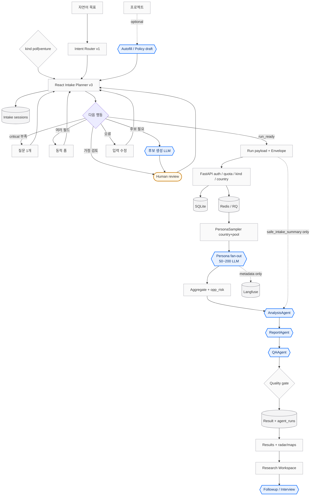

# Agentic 워크플로 요약

> 한 줄: minsim의 agentic은 **한 명의 자율 agent가 전부 처리**하는 구조가 아니라,  
> **프로젝트 컨텍스트 → 입력 정리 → 대량 페르소나 설문 → 집계 후 리포트 3단 → (선택) 후속 리서치**를 경계 있게 잇는 조립 라인이다.

상세본: [[agentic-workflow-deep]] · README: [프로젝트 README](../../README.md)

구현 기준(소스): React `intake-planner:v3-20260713`, RQ persona fan-out, LangGraph `result-agent-workflow/v1` (Analysis→Report→QA), post-run Research Workspace.

## 도형 범례

| 도형 | 의미 |
| --- | --- |
| 육각 `{{}}` | **Agent** (LLM 역할 노드) |
| 마름모 `{}` | 분기 / 정책 결정 |
| 둥근 트랙 `([" "])` | Human review |
| 원통 `[(" ")]` | 저장소 / 큐 |
| 사각 `[" "]` | 일반 시스템 단계 |

## 전체 흐름 (요약 다이어그램)



## 구간만 기억하기

| 구간 | 무엇 | Agent? |
| --- | --- | --- |
| **Project** | `poll`/`venture`, 선택적 autofill | 보조 LLM only |
| **Intake** | critical은 질문/폼, recommended는 생성 후 human review | 후보 생성 LLM (선택) |
| **Simulation** | RQ가 50~200명 응답 (+ optional protocol) | Persona fan-out (대량, LangGraph 아님) |
| **Result** | 집계 후 리포트 | **Analysis → Report → QA** (LangGraph) |
| **Post-run** | Research Workspace | followup / interview / persuasion |

## `run_ready` 이후 한 줄 체인

```text
POST /api/projects/{id}/runs 또는 POST /api/runs
→ kind/country/quota/schema 검증 → SQLite(queued) → RQ
→ running → PersonaSampler → 50~200 LLM → 집계 + opp_risk
→ AnalysisAgent → ReportAgent → QAAgent
→ quality gate → completed → 결과 UI → (선택) Research Workspace
```

## 핵심 규칙 5개

1. **프로젝트 저장 ≠ 실행.** 유형 선택 + intake + 실행 버튼 후에야 run.
2. **미검토 가정 있으면 run 거부.** human review 게이트.
3. **Persona fan-out ≠ LangGraph.** 큐/배치가 담당. 프로토콜 multi-step도 fan-out 안쪽.
4. **Result agent 입력은 안전 경계.** 집계 지표 + `safe_intake_summary` only.
5. **React planner v3가 정책 source of truth.** 서버 `/api/intake/advance`는 legacy.

## 관련 문서

- 딥 설명: [[agentic-workflow-deep]]
- Intake 정책: [[agentic-intake-workflows/intake-ux-policy]]
- LLM/Gateway: [[llm-gateway-orchestration]]
- 데이터 경계: [[data-governance-and-io-boundary]]
