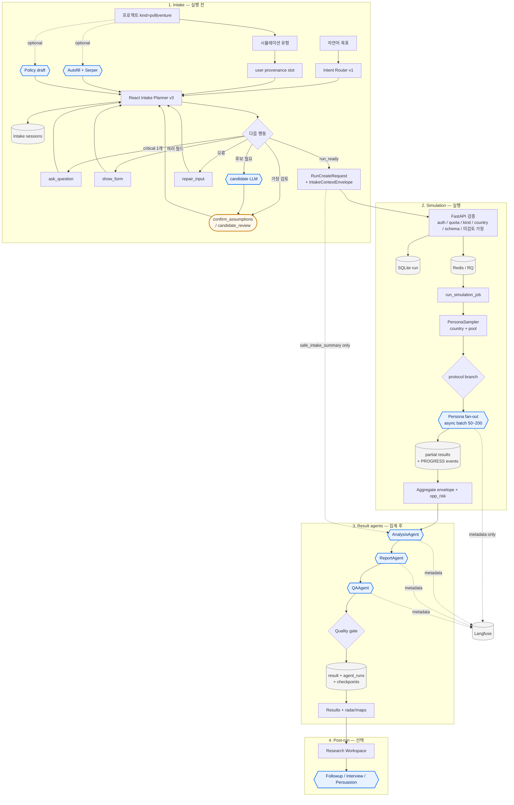

# Agentic 워크플로 상세

요약본: [[agentic-workflow-brief]] · README: [프로젝트 README](../../README.md)

이 문서는 minsim이 “agentic”이라고 부를 때의 **실제 경계, 순서, 데이터 계약, 실패 모드**를 깊게 설명한다.  
구현 기준(소스): React intake planner `intake-planner:v3-20260713`, project kind `poll`/`venture`, multi-country persona pools, versioned protocols, RQ persona fan-out, LangGraph `result-agent-workflow/v1` Analysis/Report/QA, post-run Research Workspace.

---

## 1. 한 문장 정의

minsim agentic workflow =

**deterministic control plane** (planner, schema, quota, queue, quality gate)  
+ **제한된 LLM 역할** (후보 생성, 페르소나 응답, 분석/리포트/QA)  
+ **human checkpoint** (가정·후보 검토)  
의 조립 라인이다.

“하나의 자유형 자율 agent가 목표만 보고 전부 수행하는 구조”가 **아니다**.

---

## 2. 도형 범례 (다이어그램 공통)

| Mermaid 도형 | 의미 | 예시 |
| --- | --- | --- |
| `{{"..."}}` 육각 | **Agent / LLM 역할 노드** | AnalysisAgent, Persona fan-out |
| `{"..."}` 마름모 | 정책 분기 | next action, quality gate |
| `(["..."])` 트랙 | Human | 가정 확인, 후보 수락 |
| `[("...")]` 원통 | 저장·큐 | SQLite, Redis/RQ, Langfuse |
| `["..."]` 사각 | 일반 시스템 단계 | FastAPI, 집계, UI |

Agent 노드는 다이어그램에서 **파란 육각**으로 class 지정한다.

---

## 3. 전체 아키텍처 다이어그램



---

## 4. 구간 1 — Intake

### 4.0 프로젝트 kind (실행 게이트의 일부)

| kind | 기본 pool | country | 대표 sim |
| --- | --- | --- | --- |
| `poll` | `dgist` | **kr only** | `open_survey`, `campus_policy`, `campus_priority` + 시장 sims (startup 제외) |
| `venture` | `nationwide` | 설치 국가 전부 | `startup_item_validation` + 시장 sims (campus trio 제외) |

서버 강제: `src/simulations/kind_policy.py` (`ProjectService` 경로).  
선택적 보조 LLM: `POST /api/intake/autofill` (Serper 그라운딩 가능), `POST /api/intake/policy-draft` (캠퍼스 안건).

### 4.1 프로젝트가 실행이 아닌 이유

프로젝트 CRUD는 컨텍스트 카드 저장이다. LLM fan-out·리포트는 시작하지 않는다.  
실행은 **종류 선택 → 유형 선택 → intake 완료 → 사용자 실행** 후에만 발생한다.

프로젝트 필드는 새 시뮬레이션 시작 시 slot으로 승격되며:

- `source=user`
- `evidence=saved project context`
- 이미 충족된 critical slot은 재질문하지 않음
- AI autofill로 채운 값은 `generated`로 남아 assumption review 대상

### 4.2 Slot importance 정책

| importance | 의미 | 기본 동작 |
| --- | --- | --- |
| `critical` | 없으면 책임 있게 실행 불가 | **질문 1개** 또는 폼. 가정으로 조용히 채우지 않음 |
| `recommended` | 있으면 더 정확 | 비워도 진행 가능. `canGenerate`면 생성 후 review |
| `optional` | 있으면 좋음 | 비워도 진행 |

즉 “전부 가정부터”가 아니다.  
**필수는 되묻기, 권장·보조는 생성 후 human review** 가 기본 철학이다.  
정책 상세: [[agentic-intake-workflows/intake-ux-policy]]

### 4.3 Planner actions

**제품 경로 planner 버전:** `intake-planner:v3-20260713` (`frontend/src/intake/planner.ts`, `payloadBuilder.ts`)  
서버 `src/intake/engine.py` 의 `intake-planner:v2-20260513` 와 `POST /api/intake/advance` 는 **deprecated 호환**이다. V2 UI는 advance를 쓰지 않는다.  
LLM에 next action을 전적으로 맡기지 않는다. slot 상태 기계다.

| action | 언제 | 사람? |
| --- | --- | --- |
| `ask_question` | critical 1개 부족 | 답변 입력 |
| `show_form` | 여러 structured field 부족 | 폼 제출 |
| `candidate_review` | creative 후보 없음 + 생성 가능 | 후보·가정 수정/수락 |
| `confirm_assumptions` | generated/inferred 등 미검토 가정 남음 | **가정 확인** |
| `repair_input` | 표본 수 범위 등 입력 오류 | 수정 |
| `run_ready` | 실행 가능 payload 완성 | 실행 클릭 |

### 4.4 Human review = 가정 검토

**정의:** AI/시스템이 채운 값을 시뮬레이션에 넣기 전, 사람이 “이 전제로 돌려도 된다”고 승인하는 게이트.

대표 UI: 「확인할 가정」 + **가정 확인** 버튼 (`AssumptionReviewMessage`).

| source | 의미 | review |
| --- | --- | --- |
| `user` | 직접 입력 / 후보 수락 확정 | 보통 즉시 확정 |
| `generated` | AI/생성기 | 기본 `needsUserReview=true` |
| `inferred` | 추론 | 정책상 검토 대상 가능 |
| `default` | 시스템 기본값 (sample_size=200 등) | 맥락에 따라 표시 가능 |

서버 강제:

```text
unreviewed_assumption_count > 0  →  run 생성 거부
```

Creative Testing에서는 후보 생성 시 빈 고객 슬롯을 가정으로 보완하고 `candidate_review`로 함께 보여 준다.  
이것도 human review의 한 형태다.

### 4.5 Intake 산출물

| 산출물 | 내용 |
| --- | --- |
| `RunCreateRequest` | simulation_type, input, sample_size, seed, target_filter |
| `IntakeContextEnvelope` | task frame, provenance, planner/router version |
| `safe_intake_summary` | 목표, 결정 질문, 출처별 facts, 검토된 가정, 제약, source counts |

`safe_intake_summary`에 **넣지 않는 것**:

- 원본 채팅 transcript 전문
- provider prompt 전문
- persona row / raw persona response

계약: [[agentic-intake-workflows/intake-layer-v2-contract]]

---

## 5. 구간 2 — `run_ready` 이후 Simulation

### 5.1 순서

```text
1. 사용자 실행
2. POST /api/projects/{id}/runs  (V2 기본) 또는 POST /api/runs
3. FastAPI / ProjectService 검증
   - auth (설정 시)
   - free-run quota
   - kind_policy (sim + country)
   - country dataset availability
   - schema
   - unreviewed_assumption_count == 0
4. SQLite create_run → status=queued
5. Redis/RQ enqueue(run_simulation_job)
6. 응답: run_id + events/status/result URL
7. (선택) intake session ↔ run link
8. UI → loading (SSE/polling)
```

큐 실패 시: run은 DB에 남을 수 있으나 status failed + 503.

### 5.2 Worker 실행

`src/jobs/worker.py` → `run_simulation_job`:

```text
queued → running
  → PersonaSampler(country_id, persona_pool)
  → on_progress / on_result 콜백
  → run_registered_simulation(...)  # protocol branch 포함
  → envelope 빌드 (+ optional protocol metadata)
  → metrics.opp_risk_matrix 주입 (해당 시)
  → result-agent workflow (LLM 또는 deterministic)
  → quality gate (오케스트레이션 실패는 run degrade 가능)
  → save result + agent_runs + checkpoints
  → completed | failed | canceled | interrupted
```

등록 simulation 13종: Phase 5 시장 9종 + `startup_item_validation` + `campus_policy` / `campus_priority` / `open_survey`.

### 5.3 Persona fan-out (Agent 표기, 그러나 LangGraph 아님)

| 항목 | 내용 |
| --- | --- |
| 담당 | RQ worker + async batch simulator (`src/agent/simulator.py`) |
| 규모 | 보통 50~200 |
| 표본 | multi-country Nemotron + `nationwide`/`dgist` pool |
| LLM | provider-neutral `LLMClient` (운영: Upstage solar-pro2) |
| 진행 | partial result + PROGRESS 이벤트 → SSE/UI |
| 의도적 비선택 | **per-persona LangGraph fan-out 하지 않음** |

이유: 장시간 실행, 재시도, rate-limit backoff, partial recovery, SSE replay는 큐/배치 쪽이 맞다.

### 5.4 Versioned protocol (optional)

부모 simulation type 안에서 multi-step 프로토콜로 확장한다. fan-out은 여전히 RQ/batch.

| Protocol | 부모 | 트리거 |
| --- | --- | --- |
| `price_research_v2` | `price_optimization` | `input.protocol_id` |
| `product_qa_v1` | `value_proposition` | `input.protocol_id` |
| `startup_item_validation_v1` / `v2` | `startup_item_validation` | env `STARTUP_ITEM_VALIDATION_PROTOCOL_VERSION` |

상세: [[persona-simulation-protocol-engine]]

### 5.5 Aggregate envelope

공통 필드 예:

- `run_id`, `simulation_type`, `seed`, `sample_size`, `target_filter`
- `sample_summary`, `metrics` (incl. opp_risk), `segments`, `insights`
- `quality`, `warnings`, optional `protocol`
- `orchestration` (agent status / graph)
- `raw_results` (제품 저장 가능, export/agent 기본 제외)
- `safe_intake_summary` (있으면 첨부)

이 시점까지가 “설문 집계표”. 자연어 리포트 본문은 다음 구간.

---

## 6. 구간 3 — Result Agents (LangGraph)

### 6.1 왜 집계 후에만 도는가

Result agent는 **개별 페르소나 200개 원문을 읽고 토론**하지 않는다.  
**집계된 envelope**를 읽고 해석·작성·검수한다.  
입력이 안정된 뒤에야 리포트 품질이 의미 있다.

### 6.2 체인

```text
AnalysisAgent → ReportAgent → QAAgent → quality gate
```

| Agent | 역할 | prompt 버전 (코드 기준) |
| --- | --- | --- |
| **AnalysisAgent** | summary, key_findings, segment_notes, generation verdicts | `analysis:v3-20260716` |
| **ReportAgent** | headline, recommendations, risks | `report:v2-20260512` |
| **QAAgent** | schema/근거/표본 한계 검수, severity | `qa:v3-20260716` |

구현: `src/orchestration/llm_agents.py` 의 LangGraph (`result-agent-workflow/v1`).  
`src/orchestration/graph.py` 의 prepare→execute scaffold 는 **제품 result 경로가 아니다**.  
`ENABLE_LLM_AGENTS=false` 이면 deterministic `src/orchestration/agents.py` 경로.

### 6.3 Agent 입력 allowlist

`safe_agent_input`에 들어가는 키 예:

- run metadata, sample/quality, metrics, segments, insights, warnings
- `safe_intake_summary`

기본 제외:

- `raw_results` 전문
- persona UUID full row
- raw model response / raw intake transcript

원칙:

- 결론의 **직접 증거** = aggregate metrics  
- intake summary = **목표·가정 맥락**  
- 프로젝트 설명은 맥락이지 결론 대체 증거 아님

### 6.4 Quality gate

| 조건 | 효과 |
| --- | --- |
| agent mode = fallback | warning + `review_required` |
| QA not passed / severity warning\|fail | `review_required` |
| review 필요한데 overall_grade A | **B로 강등** |

QA severity 예: `pass`, `directional_only`, `warning`, `fail`.

### 6.5 영속화

- `orchestration_checkpoints` — graph step state  
- `agent_runs` — node output, prompt version, provider metadata, scores  
- final `result` envelope  
- free-run ledger complete  

Observability (Langfuse): **metadata-only** (latency, tokens, model, status). raw payload 기본 비전송.  
정책: [[data-governance-and-io-boundary]], [[llm-gateway-orchestration]]

---

## 7. 상태 머신

```text
(intake only)
  → run_ready
  → queued
  → running
  → completed | failed | canceled | interrupted
```

| 상태 | 의미 |
| --- | --- |
| `queued` | DB 저장 + 큐 대기 |
| `running` | 표본/페르소나 LLM/집계/agents 진행 중 |
| `completed` | result 저장 완료 |
| `failed` | worker/queue/검증 실패 |
| `canceled` | 사용자/시스템 취소 |
| `interrupted` | 비정상 중단 복구 경로 |

UI 진행: `GET /api/runs/{id}/events` (SSE) 또는 status polling → 완료 시 `.../result`.

---

## 8. 구간 4 — Post-run Research

Run 완료 후 대화형 리서치가 이어질 수 있다. **main LangGraph에 묶이지 않는다.**

| 기능 | 경로 | 비고 |
| --- | --- | --- |
| Cohort follow-up | `POST .../runs/{id}/followup` | 소표본 재질문 |
| Interview threads | project interview-thread APIs | multi-turn |
| Persuasion | `POST .../persuasion` | campus opposer 조건부 재질문 |
| Redacted export | `GET .../export` | `raw_results` 제외 |
| Feedback | `POST .../feedback` | product loop |

UI: `frontend/src/v2/ResearchWorkspace.tsx`.  
(Host 도구 표면은 이 조립 라인 밖 — README [Remote MCP](../../README.md#remote-mcp).)

---

## 9. “Agent”라고 부르는 것 / 아닌 것

| 구성 | Agent 표기 | LLM | 비고 |
| --- | --- | --- | --- |
| React Intake Planner | 아니오 (control plane) | 기본 없음 | 상태 기계 · source of truth |
| Autofill / policy-draft / 후보 생성 | **예 (제한)** | 있음 | human review 또는 rate limit |
| Persona fan-out 50~200 | **예 (실행 엔진)** | 대량 | LangGraph 아님, RQ |
| Analysis / Report / QA | **예 (LangGraph)** | 소량 | 집계 후 only |
| Followup / Interview / Persuasion | **예 (post-run)** | 대화형 | Research Workspace |
| FastAPI / SQLite / Redis / kind gate | 아니오 | 없음 | 인프라 |
| Langfuse | 아니오 | 없음 | metadata 관측 |

다이어그램에서 **육각 노드만 “agent 역할”** 로 읽으면 된다.

---

## 10. 실패·복구 메모

| 실패 | 동작 |
| --- | --- |
| 미검토 가정 | run 생성 거부 |
| kind/country 불허 | run 생성 거부 |
| quota 소진 | 403 free quota |
| Redis down | run persist 후 queue fail → failed/503 |
| persona LLM rate limit | provider-aware bounded backoff |
| partial progress | partial_result 저장, SSE replay |
| analysis/report/qa LLM fail | deterministic fallback + review_required (run 자체는 완료 가능) |
| cancel mid-run | WorkerCanceled → canceled |

---

## 11. 구현 진입점

| 영역 | 경로 |
| --- | --- |
| Project kinds (FE) | `frontend/src/modes/projectKinds.ts` |
| Kind policy (BE gate) | `src/simulations/kind_policy.py` |
| Project → slot seed | `frontend/src/v2/projectIntake.ts` |
| Planner / router / payload | `frontend/src/intake/planner.ts`, `router.ts`, `payloadBuilder.ts` |
| Assumption UI | `frontend/src/components/intake/AssumptionReviewMessage.tsx` |
| V2 intake flow | `frontend/src/v2/MinsimIntakeFlow.tsx` |
| API schema / reject assumptions | `src/api/schemas.py`, `src/api/routes.py` |
| Autofill / Serper | `src/services/autofill_service.py`, `src/serper/` |
| Run create / enqueue | `src/services/run_service.py`, `src/services/project_service.py`, `src/jobs/queue.py` |
| Worker | `src/jobs/worker.py` |
| Simulation registry | `src/simulations/registry.py` |
| Protocols | `src/simulations/price_research_v2.py`, `product_qa_v1.py`, `startup_item_validation*.py` |
| Datasets / pools | `src/data/datasets.py`, `src/data/pools.py` |
| Result agents | `src/orchestration/llm_agents.py` |
| Envelope / quality | `src/jobs/result_envelope.py`, `src/orchestration/agent_scoring.py` |
| Research Workspace | `src/services/followup_service.py`, `persuasion_service.py`, `frontend/src/v2/ResearchWorkspace.tsx` |
| Store | `src/jobs/store.py` |

---

## 12. 관련 문서

- 요약: [[agentic-workflow-brief]]
- Intake universal: [[agentic-intake-workflows/universal-agentic-intake-workflow]]
- Intake UX 정책: [[agentic-intake-workflows/intake-ux-policy]]
- V2 contract: [[agentic-intake-workflows/intake-layer-v2-contract]]
- LLM gateway: [[llm-gateway-orchestration]]
- Protocol engine: [[persona-simulation-protocol-engine]]
- I/O 경계: [[data-governance-and-io-boundary]]

