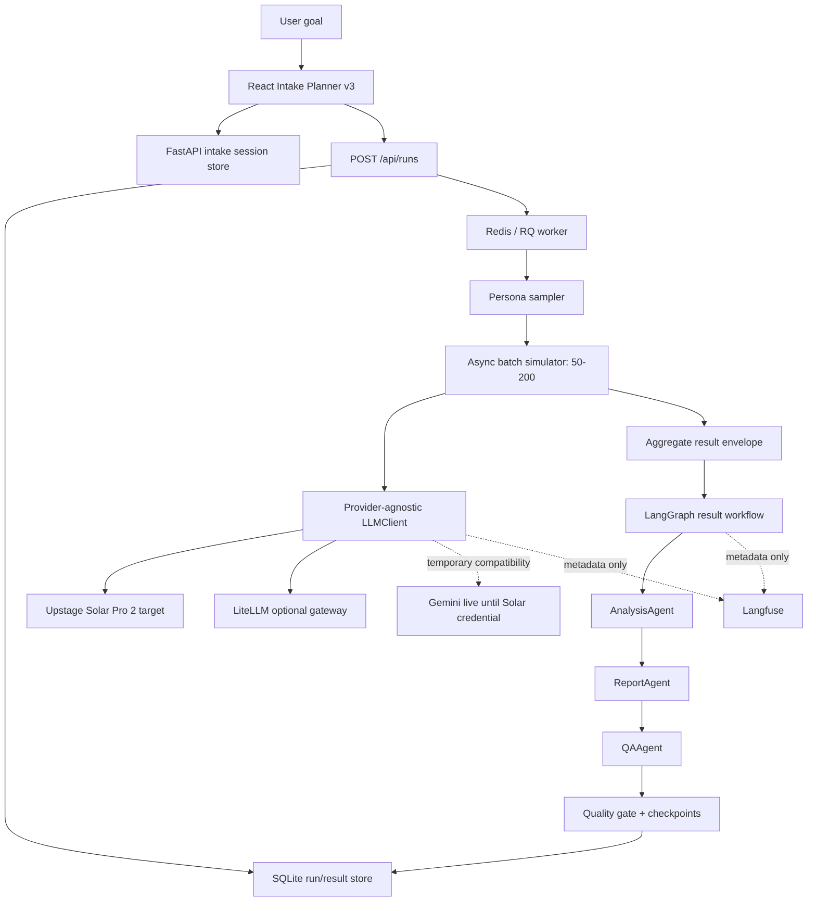

# LLM Gateway and Agentic Orchestration Design

## 1. Current Decision

KoreaSim의 **현재 live** provider는 OpenAI Chat Completions
(`LLM_BACKEND=openai`, 단일 `OPENAI_API_KEY`/`MONO_API_KEY`)다.
task-tiered 모델: persona `gpt-5.4-nano`, strong `gpt-5.4-mini`, agents
`gpt-5.6-luna`. 전역 RPM은 Redis sliding window (`LLM_MAX_RPM`, multi-worker
공유). RQ worker 5 + `CONCURRENCY=96` (2026-07-22 multi-worker gate 통과).
Upstage Solar는 명시적 env rollback. 운영 문서:
[[../execution/openai-multi-worker-rpm-v1]],
[[../runbooks/llm-openai-langfuse-operations]]. Gemini는 명시적 compatibility이며
자동 fallback으로 사용하지 않는다.

Ollama는 현재 제품·운영 fallback이 아니다. 과거 검증 artifact와 adapter는
감사 기록/호환 코드로 남길 수 있지만, 지원 backend allowlist와 LiteLLM 활성
설정에서는 제외한다.

| 영역 | AS-IS | TO-BE / 현재 결정 |
| --- | --- | --- |
| 기본 provider | Solar Pro 2 live, 외부 10/50/200 통과 | Solar 유지; Gemini는 명시적 rollback 전용 |
| backend 선택 | 잘못된 값이 Gemini로 묵시적 fallback 가능 | `upstage`, `gemini`, `litellm`, `fake`만 허용하고 즉시 실패 |
| 모델 선택 | API 요청이 임의 alias를 전달 가능 | 운영 설정에 등록된 논리 alias만 허용 |
| persona 실행 | LangGraph로 확장될 여지가 불명확 | 50–200 fan-out은 RQ + async batch에 고정 |
| 결과 agents | 별도 agent 실행과 graph scaffold가 분리 | Analysis → Report → QA가 실제 LangGraph 실행 단위 |
| intake 정책 | frontend/backend planner가 모두 기준처럼 보임 | React planner v3가 V2 단일 정책; API는 저장·검증·호환 담당 |
| 실패 처리 | deterministic fallback이 정상 결과처럼 보일 수 있음 | fallback/QA 실패는 warning, `review_required`, quality downgrade |
| 관측성 | provider/model 위주 | latency, token usage, retry, run/simulation metadata; payload는 metadata-only |

## 2. Architecture



### Execution boundaries

- FastAPI is the product and authentication boundary.
- Redis/RQ owns long-running run execution and recovery.
- Persona sampling and 50–200 LLM calls remain in the batch simulator.
- LangGraph owns only completed-run Analysis → Report → QA sequencing.
- SQLite stores runs, protected raw results, intake snapshots, agent runs, and checkpoints.
- Langfuse receives metadata only by default; it does not receive raw persona rows,
  raw chat transcripts, or `raw_results`.

## 3. LLM Client and Model Routing

Simulation modules call `LLMClient.generate()` and never import provider SDKs.
The router resolves task classes to configured aliases:

| Task | Logical route | Direct Upstage target | LiteLLM alias |
| --- | --- | --- | --- |
| persona response | `persona_default` / `persona_strong` | `solar-pro2` | `koresim/solar-persona` |
| analysis | `analysis_default` | `solar-pro2` | `koresim/solar-analysis` |
| report | `report_default` | `solar-pro2` | `koresim/solar-report` |
| schema repair | `repair_default` | `solar-pro2` | `koresim/solar-repair` |
| QA | analysis route | `solar-pro2` | `koresim/solar-analysis` |

Rules:

- Provider model IDs live in environment/LiteLLM config, not simulation modules.
- Untrusted API input can select only aliases registered in runtime config.
- A resolved response records requested alias, provider, provider model, latency,
  token usage when supplied, and retry count.
- Unknown backends fail during client creation. There is no silent fallback.
- `LLM_BACKEND=ollama` is intentionally unsupported.

### Startup validation structured-output boundary

`startup_item_validation_v2` reduces the persona fan-out from three or four
plain-text calls to one structured call per persona. The request still crosses
the provider-neutral `LLMClient` boundary and uses the unchanged
`build_system_prompt()` persona message.

- Upstage receives `response_format={"type":"json_object"}` through the
  first-class `LLMRequest.response_format` field.
- Pydantic validates required fields, enums, numeric ranges, extra fields, the
  configured alternative list, and the conditional adoption barrier.
- A schema-invalid response is repaired at most once for that persona. Exhausted
  repair fails the row instead of inventing defaults.
- The validated object is converted to the existing four-step
  `protocol_steps` result shape, so aggregate metrics and result agents keep the
  same protected input contract.
- `STARTUP_ITEM_VALIDATION_PROTOCOL_VERSION=v1|v2` is the rollback selector.
  Unsupported backends must remain on V1 until JSON-object compatibility is
  validated.
- Langfuse receives only attempt count and validation field paths. Raw prompts,
  invalid output, persona rows, and full responses remain forbidden.

JSON validity alone is not a release gate. V1/V2 comparison must preserve top
need/barrier ordering, intent direction, WTP direction, non-empty narrative
fields, and downstream QA quality.

Supported runtime modes:

| `LLM_BACKEND` | Purpose | Release status |
| --- | --- | --- |
| `upstage` | direct Solar Pro 2 production target | live 10/50/200 passed |
| `openai` / `mono` | OpenAI Chat Completions (single key, task-tiered models) | code ready; live RPM/cost gate pending |
| `litellm` | optional server-side routing to Solar aliases | config ready; live validation pending |
| `gemini` | temporary live compatibility and rollback | explicit rollback only |
| `fake` | deterministic tests/evals | supported only for non-live validation |

## 4. Intake Boundary

The V2 intake planner is `frontend/src/intake/planner.ts`, version
`intake-planner:v3-20260713`. It owns route, slot extraction, gap analysis,
candidate review, default materialization, and next-action policy.

The backend owns:

- durable snapshots through `/api/intake/sessions`;
- linking the intake session to the created run;
- Pydantic validation of `IntakeContextEnvelope`;
- rejection when `unreviewed_assumption_count > 0`;
- protected storage of the full intake record;
- forwarding only `safe_intake_summary` to result agents.

`POST /api/intake/advance` and `src/intake/engine.py` are deprecated compatibility
surfaces for old clients. They must not receive new V2 planning policy.

Automatic defaults are explicit slots with `source=default`, evidence, and a
reviewed state. The run-ready UI shows them before the user starts a run. The
server is the final guard against unreviewed generated/inferred assumptions.

## 5. Result-Agent Workflow

The worker runs one compiled graph:

```text
aggregate result
  -> AnalysisAgent
  -> ReportAgent (receives prior analysis)
  -> QAAgent (receives prior analysis/report)
  -> quality gate
  -> persist result + agent_runs + checkpoints
```

Allowed agent input is aggregate-only. It may include run metadata, metrics,
segments, insights, warnings, quality, and `safe_intake_summary`. It excludes
`raw_results`, persona UUIDs/rows, raw chat transcripts, and raw model responses.

Every node records its prompt version and mode. A deterministic fallback keeps a
run recoverable but is never presented as equivalent to a successful LLM agent:

- any fallback sets `review_required=true`;
- QA warning/fail is merged into result warnings;
- grade A is downgraded when human review is required;
- the result UI exposes agent mode, reason, and QA warnings.

## 6. Trust and Reproducibility

- The persona panel seed makes sampling reproducible.
- External LLM output is nondeterministic and is recorded separately.
- Synthetic panel results are directional product evidence, not population
  estimates or guaranteed conversion probability.
- Choice-rate uncertainty uses a Wilson 95% interval.
- Missing direct sentiment/intent observations are displayed as unavailable;
  the UI must not derive them from winner share.

## 7. Observability and Data Governance

Default trace mode is `metadata_only`. Safe fields include:

- run ID, simulation type, task type, agent name, prompt version;
- model alias, provider, provider model;
- latency, input/output/total tokens when available, retry count;
- status, parse result, QA severity, warning count.

Forbidden by default:

- API keys or authorization headers;
- persona UUIDs/full rows;
- full prompts, raw model content, raw result rows;
- raw intake transcript;
- filesystem paths or provider URLs in public health responses.

Public `/api/health` returns only service status. Detailed runtime health is an
authenticated `/api/internal/health` contract when auth is enabled.

## 8. Configuration

Production target:

```text
LLM_BACKEND=upstage
UPSTAGE_API_KEY=<secret manager or local .env only>
UPSTAGE_BASE_URL=https://api.upstage.ai/v1
UPSTAGE_MODEL=solar-pro2
MODEL_PERSONA_DEFAULT=solar-pro2
MODEL_PERSONA_STRONG=solar-pro2
MODEL_ANALYSIS_DEFAULT=solar-pro2
MODEL_REPORT_DEFAULT=solar-pro2
MODEL_REPAIR_DEFAULT=solar-pro2
ENABLE_LLM_AGENTS=true
ENABLE_LANGGRAPH=true
LLM_TRACE_MODE=metadata_only
OBSERVABILITY_PROVIDER=langfuse
```

Use `LLM_BACKEND=litellm` and the `koresim/solar-*` aliases only when the proxy
is intentionally operated. Do not add an implicit second gateway.

## 9. Solar Activation Gate

1. Inject `UPSTAGE_API_KEY` outside git.
2. Run the isolated 1–10 persona Solar smoke test.
3. Compare completion, parse success, latency, cost, and agent QA with the
   existing Gemini baseline.
4. Run the full verification gate.
5. Change the live `.env` backend/aliases, restart API and worker, and run the
   production readiness check.
6. Validate 10, then 50, then 200 personas. Do not skip directly to the largest run.

Transient provider failures use bounded exponential backoff and prefer a valid
provider `Retry-After`/`Retry-After-Ms` header. Retry count and latency remain
metadata-only; exception bodies are not added to observability payloads.

Steps 1–6 passed on 2026-07-13. Gemini is retained only as an explicit rollback
compatibility path, not a hidden fallback.

## 10. Acceptance Status

- [x] Provider-neutral client boundary and task router exist.
- [x] Unsupported backend/model aliases fail before execution.
- [x] Persona fan-out remains outside LangGraph.
- [x] Analysis → Report → QA is the actual result graph.
- [x] QA/fallback affects warnings and review state.
- [x] Intake defaults/provenance and server-side review guard exist.
- [x] Public health is minimal and detailed health is protected.
- [x] Langfuse remains metadata-only by default.
- [x] Active LiteLLM config contains Solar aliases and no Ollama route.
- [x] Solar credential is installed outside Git and an isolated live Solar run has passed.
- [x] Production Solar 10 → 50 → 200 validation has passed.
- [ ] Solar/Gemini benchmark and real customer calibration data are available.

## 11. Historical Note

Gemini and Ollama validations from May 2026 remain in phase/runbook verification
logs as historical evidence. They do not define the current provider policy.
