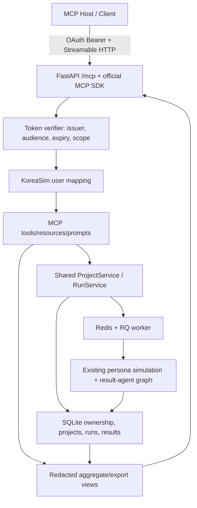

# MCP Server Integration Design

## 1. Decision Summary

KoreaSim은 `https://arabesque.cc/mcp`에 MCP HTTP endpoint를 운영하며,
2026-07-15부터 first-party OAuth 2.1 (PKCE) Bearer와 앱 헤더 `/connect` 연결
UI를 제공한다. 프로젝트·run service 재사용과 소유권 검사는 유지한다. 남은
production hardening은 custom JSON-RPC transport를 official SDK Streamable HTTP로
교체하고 호스트 호환 범위를 넓히는 일이다.

Target:

- React/FastAPI 제품과 동일한 origin의 `/mcp`를 유지한다.
- MCP tool은 기존 `ProjectService`, SQLite, Redis/RQ run lifecycle을 호출한다.
- 50–200 persona fan-out과 Analysis → Report → QA는 현재 worker 안에 유지한다.
- 원격 MCP는 공식 SDK의 Streamable HTTP와 audience-bound Bearer token을 사용한다.
- raw persona rows, raw chat transcript, hidden prompt, `raw_results`는 MCP 기본 출력에서
  제외한다.

## 2. Current Evidence (2026-07-13)

### Implemented and live

- `src/mcp/http.py`, `src/mcp/registry.py`, `src/mcp/schemas.py`가 존재한다.
- FastAPI가 `POST /mcp`, `GET /mcp`,
  `GET /.well-known/oauth-protected-resource`를 노출한다.
- 9개 tool, 4개 read-only resource URI, 1개 prompt를 제공한다.
- tool은 web API와 동일한 `ProjectService`를 호출한다.
- `tests/test_mcp_http.py`의 3개 focused test가 통과한다.
- live protected-resource metadata는 `resource=https://arabesque.cc/mcp`를 반환한다.
- 인증 없는 live `initialize` 요청은 `401`과 `WWW-Authenticate`를 반환한다.
- 공유 private-pilot Bearer key 경로는 폐기됐다. 현재 MCP는 signed Google-login
  session cookie가 있는 사용자만 허용하고, Bearer-only 요청은 401을 반환한다.
- session-authenticated initialize/tools/resources와 redacted export tests가 통과하며,
  Origin allowlist는 로그인 상태에도 적용된다.
- 2026-07-13 production deployment에서 anonymous initialize와 Bearer-only initialize는
  모두 401, protected-resource metadata는 `google_session_cookie`만 반환했고 Google
  login 시작은 accounts.google.com으로 303 redirect됐다.
- 최초 구현 commit은 `553856c` (`feat: add authenticated mcp endpoint`), 문서 commit은
  `c211082` (`docs: document minsim v2 ux and mcp`)다.

### Gaps

| 영역 | 현재 | 목표 |
| --- | --- | --- |
| Transport | custom FastAPI JSON-RPC handler | official stable MCP SDK Streamable HTTP |
| Auth credential | signed Google-login session cookie only; shared key retired | OAuth 2.1-compatible per-user audience-bound Bearer token |
| Authorization server | metadata가 same-origin issuer를 가리키지만 RFC 8414/OIDC token flow 없음 | 실제 discovery, PKCE, token issuance/validation |
| Token binding | MCP audience 검증 없음 | `https://arabesque.cc/mcp` audience/resource 검증 |
| Protocol lifecycle | server가 protocol version을 고정 반환 | client version negotiation + protocol header 검증 |
| HTTP security | Origin/Accept/version 검증이 불완전 | SDK transport + explicit Origin allowlist |
| Tool errors | validation/service error가 protocol error로 반환됨 | recoverable tool execution error + `isError` |
| Tool metadata | input schema 중심 | output schema, annotations, cost/write hints |
| Long-running run | create 후 별도 web API 의존 | MCP status/result polling contract |
| Retry safety | mutating/costly tool idempotency 없음 | client request id + deduplication |
| Discovery scale | project 최대 50개 고정 | cursor pagination |
| Interoperability | TestClient/session-cookie 중심 | official client + Inspector + target hosts E2E |

현재 endpoint를 “완전한 production remote MCP”로 표현하지 않는다. 올바른 표현은
“배포된 MCP foundation / custom transport, remote OAuth hardening pending”이다.

## 3. Protocol Baseline

Implementation baseline은 현재 공개 stable 규격인 MCP `2025-11-25`다.

- Transport: https://modelcontextprotocol.io/specification/2025-11-25/basic/transports
- Authorization: https://modelcontextprotocol.io/specification/2025-11-25/basic/authorization
- Tools: https://modelcontextprotocol.io/specification/2025-11-25/server/tools
- Python SDK: https://github.com/modelcontextprotocol/python-sdk

2026-07-13 현재 공식 Python SDK v2는 pre-release이며 production 사용이 권장되지
않는다. 구현 시점의 stable v1을 exact pin하고 `<2` upper bound를 둔다. 2026-07-28
예정 spec/SDK release 이후 별도 compatibility checkpoint에서 v2 전환 여부를 판단한다.
pre-release 채택을 MCP hardening의 선행 조건으로 만들지 않는다.

## 4. Target Architecture

The MCP layer is an adapter. It does not own simulation logic, provider routing,
persona sampling, result-agent orchestration, or persistence policy.

## 5. Authentication and Authorization Boundary

### Web auth

The existing Google OAuth login and signed HTTP-only cookie remain valid for the
React web application and the current session-only MCP interim. A browser cookie is
not the final production remote MCP credential and must never be copied into client
configuration or logs.

### Remote MCP auth

2026-07-13 보안 정책 변경으로 shared `KORESIM_MCP_API_KEY` 인증은 제거됐다.
현재 custom endpoint는 `read_session_user()`가 검증한 signed Google-login session만
`UserRecord`로 매핑한다. Bearer header만 제공한 요청은 설정에 과거 키가 남아 있어도
401이며, 로그인된 요청도 `Origin`이 allowlist와 일치하지 않으면 403이다. 이는
“로그인한 사용자만”을 강제하는 안전한 interim이며 일반 MCP host용 OAuth 완료를
의미하지 않는다.

Production OAuth target에서는 MCP server가 OAuth resource server로 동작하고 다음을
검증한다.

OAuth access tokens must pass all of these checks:

- trusted issuer;
- signature and expiry;
- audience/resource bound to `https://arabesque.cc/mcp`;
- required scope;
- mapped KoreaSim user identity;
- revoked/disabled account policy when available.

Recommended authorization-server decision: use a managed or separately maintained
OAuth 2.1 authorization server that supports PKCE, RFC 8414 or OIDC discovery,
resource indicators/audience binding, and public MCP clients. Google may remain the
upstream identity provider, but a Google access token issued for Google APIs must not
be accepted directly as a KoreaSim MCP token.

Before implementation, select one option and record it in the execution plan:

1. managed OAuth authorization server/broker — recommended;
2. first-party authorization server — only with a separate security design/review;
3. pre-registered service tokens — limited private pilot only, not the general-user
   OAuth completion gate.

Proposed scopes:

- `koresim:read`: project/run metadata and redacted result resources;
- `koresim:run`: project changes, simulation creation, follow-up, interview;
- `koresim:feedback`: feedback submission.

## 6. Tool and Resource Contract

### Read path

- list/get projects;
- list project runs;
- get run status/progress;
- get completed redacted result/export;
- read project/run resources with cursor pagination.

### Write/cost path

- create/update/archive project;
- create project run through the normal quota and RQ path;
- submit feedback;
- ask follow-up;
- start/continue persisted interview thread.

Every tool has:

- validated input schema and explicit structured output schema;
- `readOnlyHint`, `destructiveHint`, `idempotentHint`, `openWorldHint` annotations;
- a clear description of quota/cost and side effects;
- tool-readable validation failures without raw stack traces;
- optional `client_request_id` for deduplication of mutating or costly calls.

`create_project_run` returns a run identifier and status URI immediately. The MCP
request does not hold an HTTP connection for a 50–200 persona job. Clients poll a
status tool/resource and read the redacted result only after completion.

### Data policy

Allowed by default:

- project fields owned by the authenticated user;
- run status/progress;
- aggregate metrics, segments, insights, warnings, quality metadata;
- human-review export without `raw_results`;
- safe identifiers needed for project/run navigation.

Excluded by default:

- `raw_results` and raw persona rows;
- persona UUID lists and raw LLM responses;
- raw intake transcript;
- internal prompts, provider credentials, stack traces, local paths.

## 7. Transport and Security Controls

- Use Streamable HTTP at the existing single `/mcp` path.
- Stateless JSON response mode is acceptable for V1; authenticated `GET /mcp` may
  return `405` when no server-initiated SSE stream is offered.
- Validate `Origin` when present and return `403` for untrusted origins.
- Enforce request content type, `Accept`, MCP protocol version, body-size limit, and
  safe batch policy through the SDK/server boundary.
- Never log Bearer tokens, cookies, raw prompts, raw personas, or raw results.
- Apply account quota plus per-user/IP rate limits to costly tools.
- Write audit metadata for run creation, export, follow-up, and interview actions.
- Preserve project/run ownership checks inside the shared service layer.

## 8. Deployment and Rollback

- Introduce `MCP_ENABLED` and a transport/auth rollout flag.
- Keep the custom route available only as a short-lived rollback implementation, not
  as a second public MCP URL.
- Canary with test accounts before enabling production OAuth for all users.
- Normal release gate remains verify → scoped commit → build/restart API and worker →
  external production check.
- Tunnel restart is not required unless its configuration changes.

## 9. Deferred Scope

- moving persona fan-out into MCP or LangGraph;
- exposing raw persona datasets through resources;
- MCP Apps/UI extensions;
- general third-party plugin marketplace publication;
- official Python SDK v2 pre-release adoption;
- billing/account/org redesign.
