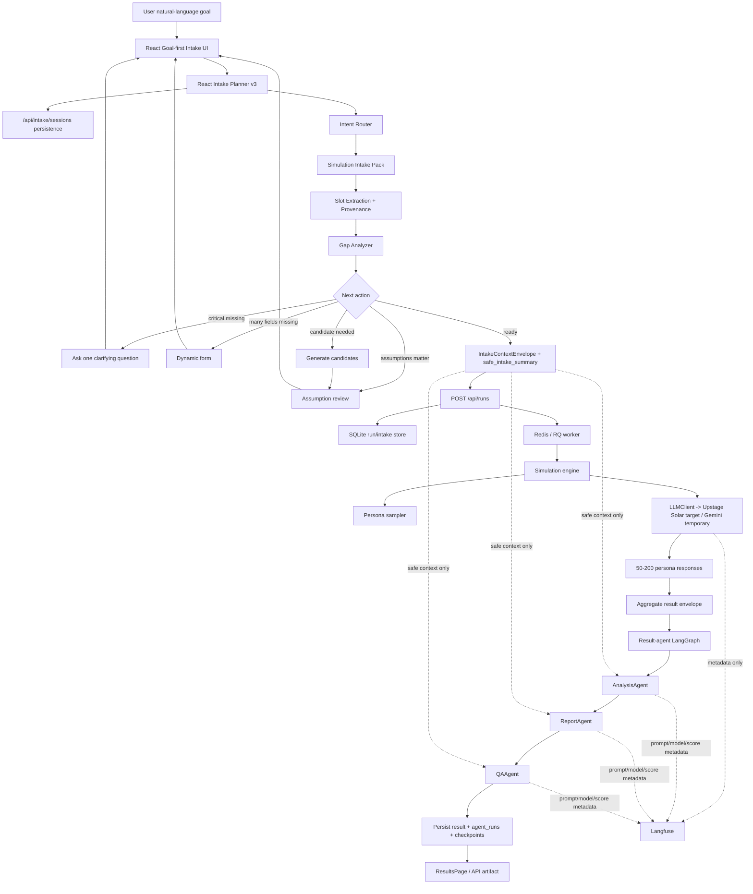

# KoreaSim Coding Agent Guide

## Scope

This guide applies to the KoreaSim project rooted at:

`/Users/byeongsu/obsidian-org-vault/org/organization/product/waterfall.run/koresim`

The git repository root is the parent vault:

`/Users/byeongsu/obsidian-org-vault`

Do not treat unrelated Obsidian vault changes as part of this project unless the user explicitly asks.

## Product Direction

- Product: KoreaSim, a Korean AI persona behavior simulation B2B SaaS.
- Target architecture: React + FastAPI external demo.
- Keep `app.py` Streamlit as internal fallback only.
- Public domain plan: `https://arabesque.cc`.
- Route policy: `/` and safe status/documentation endpoints are publicly reachable through Cloudflare Tunnel. Cloudflare Access allowlists are no longer part of the current demo target; `/app*`, `/results*`, and run/preset/export APIs use app-level Google auth when configured.
- Queue and persistence: Redis + RQ worker, SQLite job/result store.
- LLM direction: provider-agnostic `LLMClient`, Upstage `solar-pro2` production target, optional LiteLLM Proxy, Gemini temporary live compatibility until the Upstage credential is provisioned, no Ollama runtime fallback, Langfuse metadata-only observability.

## Live Deployment

Current live deployment is not Vercel. It is a local Mac Studio/FastAPI origin exposed through Cloudflare Tunnel:

- Public URL: `https://arabesque.cc`
- Origin: `uv run uvicorn src.api.main:app --host 127.0.0.1 --port 8000`
- React production build: `frontend/dist`, served by FastAPI via `src/api/static.py`
- Tunnel: Cloudflare Named Tunnel using `/Users/qts/.cloudflared/koresim-arabesque.yml`
- launchd services:
  - `com.koresim.api` — FastAPI origin
  - `com.koresim.worker` — RQ worker
  - `com.koresim.tunnel` — Cloudflare tunnel
- Runtime data: `/Users/qts/koresim-runtime`

Deployment update procedure:

```bash
npm --prefix frontend run build
launchctl kickstart -k gui/$(id -u)/com.koresim.api
launchctl kickstart -k gui/$(id -u)/com.koresim.worker
uv run python scripts/check_mac_studio_production.py --external --timeout-seconds 15
```

Deployment cadence (standing rule): 각 변경 사이클을 마치면 반드시 커밋하고 즉시 위 절차로 배포한다.
- 순서: `uv run python scripts/verify.py`(게이트) → 커밋(koresim-v2 범위만 스테이징) → 위 배포 절차 실행.
- 배포는 프로덕션 launchd(`com.koresim.api`/`com.koresim.worker`) 재시작을 포함하며, 사용자가 상시 승인했다.
- 게이트가 실패하면 배포하지 않는다.

The tunnel usually does not need a restart for normal frontend/backend code changes because it forwards to the FastAPI origin. Restart `com.koresim.tunnel` only when Cloudflare tunnel config or connectivity changes.

When adding new public static asset folders under `frontend/public`, make sure both of these are updated:

- `src/api/static.py` mounts the built `frontend/dist/<folder>` directory.
- `src/api/main.py` `_is_public_path()` allows the route when it must load on the public landing page before login.

## Required Reading Before Complex Work

Read the relevant files before editing:

- `README.md` for roadmap and methodology.
- `CLAUDE.md` for current phase status.
- `docs/phases/<phase>.md` for phase tasks and done definitions.
- `docs/execution/<plan>.md` for detailed execution plans.
- `docs/design/harness-engineering-controls.md` for engineering controls.
- `docs/runbooks/autonomous-work-session.md` before long-running autonomous work.
- `docs/runbooks/next-autonomous-implementation.md` after a session reset or before multi-hour implementation.
- `docs/runbooks/cloudflare-tunnel-operations.md` before touching Cloudflare Tunnel or legacy Access helpers.
- `docs/runbooks/llm-gemini-langfuse-operations.md` before external LLM or observability work.

For complex implementation, create or update an execution plan using:

`docs/templates/execution-plan-template.md`

## Agent Architecture Records

When working on KoreaSim's LLM/agent structure, treat these files as the source of truth:

- `README.md` — product-level architecture and plain-language Korean agent flow for orientation.
- `docs/design/llm-gateway-orchestration.md` — LLM client boundary, LiteLLM routing, LangGraph run-level scope, analysis/report/QA agent roles, memory boundaries.
- `docs/phases/phase-7-llm-gateway-orchestration.md` — validated Phase 7 gate, current agent orchestration status, validation evidence, and deferred scope.
- `docs/execution/ai-agent-improvement-loop-v1.md` — `agent_runs` storage, prompt versions, eval harness, artifact contract, and run-level checkpoint persistence.
- `docs/execution/agentic-intake-layer-v2.md` — current intake-agent execution plan and validation log.
- `docs/design/agentic-intake-workflows/intake-layer-v2-contract.md` — React planner v3 source-of-truth, `IntakeContextEnvelope`, `safe_intake_summary`, session persistence, deprecated `/api/intake/advance`, and result-agent safe context contract.
- `docs/design/agentic-intake-workflows/universal-agentic-intake-workflow.md` — goal-first intake workflow, slot/provenance model, and planner policy.
- `docs/design/agentic-intake-workflows/simulation-intake-pack-standard.md` — common intake engine plus simulation-specific pack contract.
- `docs/design/agentic-intake-workflows/intake-evaluation-fixtures-plan.md` — intake regression fixture categories and pass/fail criteria.
- `docs/runbooks/llm-solar-langfuse-operations.md` — Solar/LiteLLM/Langfuse activation, rollback, credential, and metadata-only observability policy.

Current architectural boundary:

- Do not move persona fanout into LangGraph by default. Keep 50-200 persona response generation in the existing RQ worker and async batch simulator.
- LangGraph is used for the actual Analysis → Report → QA result workflow and checkpointing, not per-persona branching.
- Result-level agents operate after aggregate result envelopes are complete: `AnalysisAgent`, `ReportAgent`, and `QAAgent`.
- Intake agent behavior converts user goals into structured slots and `safe_intake_summary`; result agents may use only safe summaries, not raw chat transcripts.
- Langfuse payloads remain metadata-only by default.

Overall flow:



Important data boundaries:

- `raw_results` stay in protected product storage and must not be sent to Langfuse by default.
- `safe_intake_summary` may be included in result-agent prompts and stored agent records.
- full raw chat transcript is an intake record, not a default result-agent input.
- per-persona response fanout remains outside LangGraph.

## Architecture Change Logging

Important architectural changes must leave a durable record in the same change set.

Update the relevant docs whenever a change affects:

- agent boundaries, prompt versions, model routing, or LangGraph nodes/checkpoints.
- intake schema, `safe_intake_summary`, slot provenance, or `/api/intake/*` behavior.
- result envelope shape, `agent_runs` storage, eval scoring, or artifact contracts.
- queue/RQ behavior, persistence schema, auth boundaries, deployment topology, or observability payload policy.

Required logging pattern:

- Update the relevant design doc under `docs/design/`.
- Update or create the execution plan under `docs/execution/` using `docs/templates/execution-plan-template.md`.
- Update `CLAUDE.md` when the current project status, active phase, validation evidence, or deferred scope changes.
- Add validation evidence to the execution plan only after the command/API/browser check has actually passed.
- If the change is agent-related, record prompt/router/planner versions and eval fixture coverage.

## Skill Routing

When the task matches one of these modes, use the matching installed skill together with this project guide:

- Planning a coding task: `create-plan`
- Understanding risk before editing unfamiliar areas: `codebase-recon`
- Large migration or multi-file refactor: `codebase-migrate`
- PR/code review: `brooks-review`
- Architecture audit or codebase tour: `brooks-audit`
- Technical debt prioritization: `brooks-debt`
- Test suite quality review: `brooks-test`
- Overall quality report before a release gate: `brooks-health`
- GitHub Actions failure diagnosis: `gh-fix-ci`
- Browser/webapp verification: `webapp-testing`

Avoid broad framework skills that impose a separate product operating system unless the user explicitly requests them.

## Engineering Rules

- Prefer existing project patterns over new abstractions.
- Keep changes scoped to the active phase or requested task.
- Do not add new Streamlit-first behavior for the external demo path.
- API/schema changes must be reflected in frontend TypeScript types and fixtures.
- LLM provider SDKs must not be imported directly from simulation modules; use the internal LLM client boundary.
- Product result storage may keep protected `raw_results`; external provider and observability payloads should default to metadata-only.
- Preserve user/unrelated vault changes. Never revert files outside the task scope.

## Phase Discipline

- Before implementation, identify the active phase and the relevant execution plan.
- Update phase checkboxes only when the corresponding validation has actually passed.
- Keep `CLAUDE.md` as the project tracker; keep this file as the coding-agent operating guide.
- If the requested work changes architecture, API schemas, queue behavior, auth boundaries, or deployment topology, update the relevant design or execution document in the same change.
- During autonomous sessions longer than 2 hours, checkpoint every 2 hours: stop scope expansion, verify, commit coherent passing work, push when committed, and report status.

## Secrets And Credentials

- Never commit `.env`, API keys, Cloudflare certs, tunnel JSON credentials, tunnel tokens, Langfuse keys, or provider credentials.
- Real Upstage, Gemini, Cloudflare, LiteLLM, and Langfuse secrets belong only in local `.env`, shell environment, or a secret manager.
- `.env.example` may contain names and placeholders only.
- If a secret appears in chat, code, docs, logs, or git history, treat it as compromised and rotate it.

## Verification

Run the project verification command before reporting implementation complete:

```bash
uv run python scripts/verify.py
```

This currently covers:

- Ruff lint
- deterministic eval fixtures
- pytest with backend coverage threshold
- frontend lint
- frontend typecheck
- frontend production build

If only a faster local check is appropriate, explain what was skipped and why.

## CI And Git

- GitHub workflow lives at the vault repo root:
  `.github/workflows/koresim-ci.yml`
- Workflow filters target this project subtree.
- Repository is private.
- Use branch prefix `codex/` unless instructed otherwise.
- Stage only project files and required root CI files.
- Do not stage unrelated vault files.

## Current Quality Gates

- Backend coverage threshold: 85%.
- Deterministic eval fixtures must pass.
- API envelope fixture and frontend schema parity must pass.
- Queue health should distinguish Redis reachability from active RQ worker readiness.

## Active Phase

Current active phase is Phase 5/7 live validation.

Phase 1, Phase 2, Phase 5, Phase 6, and Phase 7 gates are validated for the public external demo. Current remaining work is post-demo productization:

- PR/main release operation after CI approval.
- app-level auth polish and login-backed E2E expansion.
- Upstage credential provisioning and Solar Pro 2 live validation/benchmark.
- V2 research/product features such as consistency scoring, report export policy, advanced crowd visualization, account/org/billing, and legal/data-retention policy.
