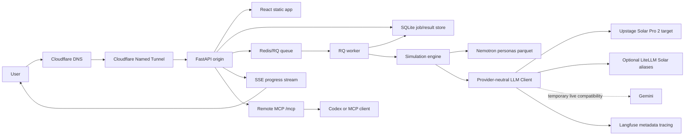
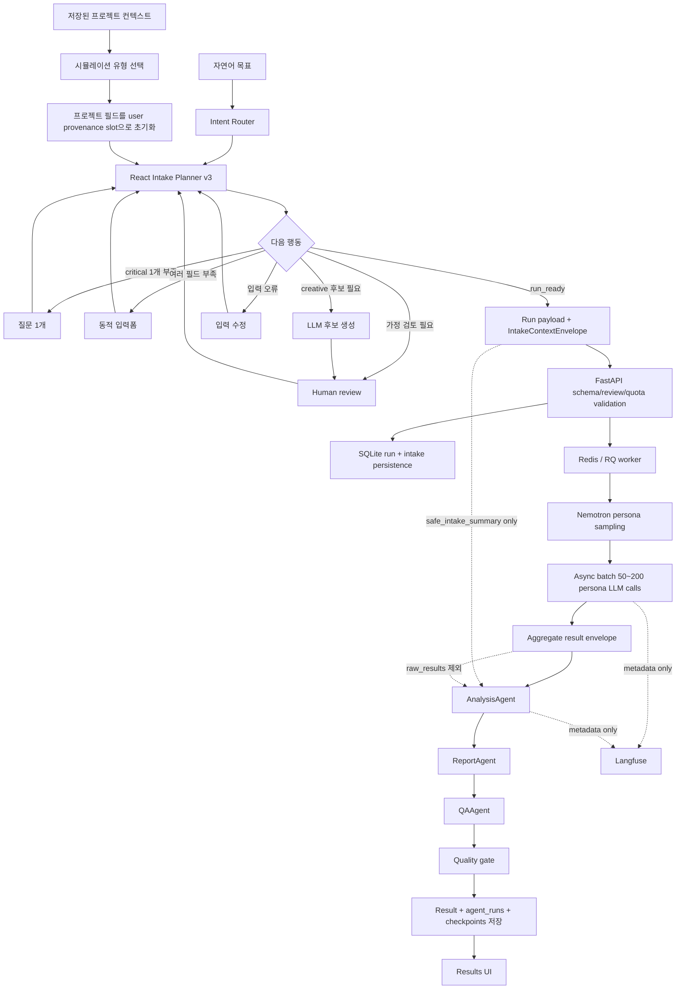

# KoreaSim

KoreaSim is a Korean AI human-behavior simulation product built on NVIDIA Nemotron-Personas-Korea, provider-neutral LLM routing, and a React + FastAPI application surface.

## Current Decisions

- Public domain: `https://arabesque.cc`
- External demo stack: React frontend + FastAPI backend
- Legacy/internal surface: Streamlit may remain as an operator fallback, but is no longer the primary MVP surface
- Tunnel strategy: Cloudflare Named Tunnel to the FastAPI origin
- Auth strategy: Cloudflare Access allowlists are not part of the current demo target. The landing/status surface is public through Cloudflare Tunnel; `/app*`, `/results*`, and run/preset/export APIs require FastAPI Google OAuth when auth is configured. Test/staging E2E can use a disabled-by-default test-login endpoint.
- Launch quota strategy: authenticated new users receive 5 free simulation runs by default. Run creation is guarded server-side through SQLite user records and a usage ledger; admin/bypass emails can be configured by environment.
- Runtime persistence: SQLite job/result store
- Job execution: RQ worker backed by Redis
- Realtime progress: Server-Sent Events, with polling fallback
- Remote MCP: `https://arabesque.cc/mcp` is exposed through the same Cloudflare Tunnel. The current private pilot accepts a dedicated KoreaSim MCP Bearer API key; browser Google login remains available, while standards-complete OAuth is tracked as follow-up hardening.
- Result trust layer: quality indicators, sample summary, seed, and disclaimer are part of the common result schema from the start
- LLM strategy: production routes to Upstage `solar-pro2` behind a provider-agnostic `LLMClient`. The external MCP 10 → 50 → 200 gate passed after provider-aware bounded backoff was added. LiteLLM is optional, Gemini is explicit rollback compatibility, Ollama is not a supported runtime fallback, and observability is metadata-only.
- Agentic intake strategy: React planner v3 is the V2 planning source-of-truth. Natural-language goals become provenance-tagged slots, `IntakeContextEnvelope`, and `safe_intake_summary`; FastAPI persists sessions and rejects unreviewed assumptions.
- Data governance: full `raw_results` can be stored/returned in the protected product, but external provider and observability payloads default to minimal metadata

## Product Goal

Help Korean teams test product, pricing, marketing, and policy decisions before launch by simulating responses from Korean synthetic personas.

The first working demo should make one thing credible:

> A user can visit `arabesque.cc`, understand KoreaSim from the public landing page, enter the app at `/app`, run a Korean persona simulation, watch progress live, and inspect a trustworthy result with sample and quality context.

## Architecture



## Agentic Workflow

KoreaSim의 현재 agentic workflow는 하나의 자유형 autonomous agent가 모든 일을
처리하는 구조가 아니다. 실행 전에는 검증 가능한 React planner가 입력 상태와
다음 행동을 결정하고, 실행 중에는 RQ/async batch가 50~200명 페르소나 fan-out을
담당하며, 집계가 끝난 뒤에 실제 LangGraph `Analysis -> Report -> QA` agent chain이
리포트를 만든다.

프로젝트를 저장하는 것만으로는 LLM 호출이나 리포트 생성이 시작되지 않는다.
사용자가 `새 시뮬레이션`에서 유형을 선택하고 intake 검토를 마친 뒤 실행해야 하며,
`Run history`는 그렇게 생성된 run의 상태와 결과를 보여준다.



### 1. 프로젝트 컨텍스트가 intake로 들어가는 방식

프로젝트 화면의 필드는 저장 시점에는 일반 프로젝트 데이터다. 새 시뮬레이션을
시작하면 선택한 simulation type에 맞는 slot으로 변환되며, 모두 `source=user`,
`evidence=saved project context`로 기록된다. 저장된 값으로 이미 충족된 critical
slot은 다시 묻지 않는다.

| 프로젝트 필드 | 공통/주요 slot | simulation별 추가 사용 |
| --- | --- | --- |
| 이름 | 프로젝트 식별자 | 시장 세분화 `category`, 브랜드 인식 `brand_name`, 이탈 예측 `service_name`, 경쟁 포지셔닝의 첫 번째 `product` |
| 설명·제품 컨텍스트 | `product_description`, `product_context` | 제품 출시 `product_concept`, 시장 세분화 `product_family`, 경쟁 포지셔닝 `category_context` |
| 기능 | `key_features` | 제품 출시의 핵심 기능 입력 |
| 가격 | `price_points` | 가격 최적화의 비교 가격 후보 |
| 타겟 메모 | `target_customers` | 제품 출시 `target_use_case`; 인구통계 문구는 지원 범위 내에서 `target_filter`로 변환 |
| 대안/경쟁재 | simulation별 컨텍스트 | 경쟁 포지셔닝 `products`, 브랜드 인식 `comparison_brands`, 이탈 예측 `competitor_offer` |

현재 `target_filter` 자동 추출은 연령대, 여성/남성, 서울/경기 표현을 지원한다.
예를 들어 `20~40대 여성`은 20~49세 여성 패널 조건으로 정규화된다. 자유 형식
타겟 문장 전체가 데이터셋의 임의 필드 검색으로 변환되는 것은 아니다.

프로젝트 기반 V2 경로에서는 사용자가 simulation type을 명시적으로 고르므로 그
선택이 우선한다. 명시적 선택이 없는 intake에서는 keyword-scored intent router가
9개 simulation pack 중 후보를 정하고 `TaskFrame`에 목표, 결정 질문, 후보 유형,
confidence와 evidence를 남긴다.

### 2. React Intake Planner v3

현재 V2 planning source of truth는 `intake-planner:v3-20260713`이다. planner는 LLM에
다음 행동을 전적으로 맡기지 않고 slot requirement와 상태에 따라 아래 action 중
하나를 결정한다.

- `ask_question`: 책임 있게 실행하는 데 필요한 critical slot 하나를 질문한다.
- `show_form`: 여러 structured field가 비어 있을 때 한 번에 짧은 폼을 보여준다.
- `candidate_review`: Creative Testing 후보가 없을 때 후보와 가정을 사용자에게 보여준다.
- `confirm_assumptions`: 생성·추론된 중요 가정을 실행 전에 승인받는다.
- `repair_input`: 표본 수, 후보 개수 등 잘못된 입력을 수정하게 한다.
- `run_ready`: 검증 가능한 `RunCreateRequest`와 provenance를 만든다.

Creative Testing의 candidate review에서는 `/api/intake/candidates`를 통해 LLM 후보를
요청하고, 15초 timeout 또는 provider 실패 시 deterministic 기본 후보를 유지한다.
현재 이 live candidate-generation 연결은 creative headline 경로에 한정된다. 다른
simulation pack의 `canGenerate` 표시는 review 가능한 보완 정책을 뜻하며, 모든 빈
필드를 LLM이 자동 조사하거나 생성한다는 뜻은 아니다.

Planner 기본값도 provenance slot으로 명시된다. 공통 기본값은 `sample_size=200`,
`seed=42`이며, 시장 세분화는 `n_segments=6`, 캠페인 전략은
`budget=100000000`을 추가한다.

### 3. Provenance, human review, safe context

모든 intake slot은 다음 출처 중 하나를 유지한다.

| source | 의미 |
| --- | --- |
| `user` | 사용자가 직접 입력했거나 저장된 프로젝트에서 가져온 사실 |
| `inferred` | 입력으로부터 추론한 값 |
| `generated` | AI 또는 후보 생성기가 만든 값 |
| `default` | 버전이 있는 시스템 기본값 |

실행 직전 frontend는 task frame, provenance, planner/router version,
`safe_intake_summary`를 포함하는 `IntakeContextEnvelope`를 만든다. FastAPI는 schema와
simulation input을 다시 검증하고 `unreviewed_assumption_count > 0`이면 run 생성을
거부한다. Intake snapshot은 `/api/intake/sessions`에 저장되고 생성된 run과 연결된다.

`safe_intake_summary`에는 사용자 목표, 결정 질문, simulation type, 출처별 facts,
검토된 가정, 생성 후보, 제약과 source counts만 들어간다. 원본 대화 transcript,
provider prompt, persona row, raw persona response는 포함하지 않는다.

### 4. Persona simulation execution

FastAPI가 run을 SQLite에 먼저 저장하고 Redis/RQ job을 enqueue한다. Worker는 seed와
target filter로 Nemotron 한국 페르소나를 표본화하고 provider-neutral `LLMClient`를
통해 50~200개 persona response를 async batch로 생성한다. 각 응답은 partial result와
progress event로 저장되어 SSE와 polling 복구에 사용된다.

이 fan-out은 의도적으로 LangGraph node fan-out이 아니다. RQ가 장시간 실행·복구를,
simulation engine이 병렬 persona 호출·parsing·집계를 담당한다. 운영 목표 provider는
Upstage `solar-pro2`이며 model route는 배포 환경의 provider 설정으로 결정된다.
Gemini는 명시적 compatibility/rollback 경로로만 남고, Ollama runtime fallback은
지원하지 않는다.

### 5. Result-agent LangGraph

집계된 result envelope가 완성된 뒤 worker가 실제 compiled LangGraph를 실행한다.

1. `AnalysisAgent` (`analysis:v2-20260512`)가 metrics, segments, quality와 warning을
   근거로 요약, 핵심 발견, segment note를 만든다.
2. `ReportAgent` (`report:v2-20260512`)가 aggregate result와 prior analysis를 받아
   headline, 우선순위별 recommendation, risk와 mitigation을 만든다.
3. `QAAgent` (`qa:v2-20260512`)가 schema, 근거, parse failure, 표본 한계를 검수하고
   `pass`, `directional_only`, `warning`, `fail` 중 severity를 반환한다.

Agent prompt allowlist에는 run metadata, sample/quality, metrics, segments, insights,
warnings와 `safe_intake_summary`만 들어간다. `raw_results`, persona UUID/full row, raw
model response, raw intake transcript는 제외된다. 프로젝트 입력은 리포트의 목표와
맥락을 맞추는 데 사용하고, 결론의 직접 증거는 aggregate metrics여야 한다.

각 node의 LLM/parse 실패에는 deterministic fallback이 적용되어 run 자체는 복구할
수 있다. 단 fallback agent가 있거나 QA가 통과하지 못하면
`quality.review_required=true`가 되고 warning이 결과에 추가되며, A등급 결과는
B등급으로 내려간다. Node output, prompt version, provider metadata, deterministic
score는 `agent_runs`에, 단계별 graph state는 `orchestration_checkpoints`에 저장된다.

### 6. 정확한 agentic 경계

| 영역 | 현재 구현 | LLM 사용 |
| --- | --- | --- |
| 프로젝트 저장 | 컨텍스트 CRUD와 run history | 없음 |
| Intent/slot/next action | 버전 고정 React planner와 deterministic validation | 기본적으로 없음 |
| Creative 후보 생성 | API를 통한 후보 생성 + human review + local fallback | 있음 |
| Persona simulation | 50~200명 response 생성과 parsing | 있음 |
| Result workflow | LangGraph `Analysis -> Report -> QA` | 있음; 실패 시 명시적 fallback |
| Queue/recovery/persistence | FastAPI + Redis/RQ + SQLite | 없음 |
| Langfuse | latency, token, model, status 등 metadata trace | 원문 payload 전송 없음 |

따라서 KoreaSim의 “agentic”은 무제한 자율 실행이 아니라, deterministic control
plane과 제한된 LLM 역할, human checkpoint, 결과 품질 게이트를 결합한 workflow다.

주요 구현 source of truth:

- Project seed: [`frontend/src/v2/projectIntake.ts`](frontend/src/v2/projectIntake.ts)
- Planner/router/payload: [`frontend/src/intake/planner.ts`](frontend/src/intake/planner.ts), [`frontend/src/intake/router.ts`](frontend/src/intake/router.ts), [`frontend/src/intake/payloadBuilder.ts`](frontend/src/intake/payloadBuilder.ts)
- V2 intake UI/session/run link: [`frontend/src/v2/MinsimIntakeFlow.tsx`](frontend/src/v2/MinsimIntakeFlow.tsx)
- API validation: [`src/api/schemas.py`](src/api/schemas.py), [`src/api/routes.py`](src/api/routes.py)
- RQ simulation worker: [`src/jobs/worker.py`](src/jobs/worker.py)
- Result-agent graph: [`src/orchestration/llm_agents.py`](src/orchestration/llm_agents.py)
- Result envelope and quality scoring: [`src/jobs/result_envelope.py`](src/jobs/result_envelope.py), [`src/orchestration/agent_scoring.py`](src/orchestration/agent_scoring.py)
- Durable storage: [`src/jobs/store.py`](src/jobs/store.py)

## Repository Map

```text
.
├── README.md
├── CLAUDE.md
├── app.py                         # Streamlit fallback, not primary external demo
├── frontend/                      # React/Vite UI
├── src/                           # Python simulation engine and shared modules
├── docs/
│   ├── prd.md
│   ├── data-spec.md
│   ├── design/
│   │   ├── react-fastapi-migration.md
│   │   ├── llm-gateway-orchestration.md
│   │   ├── harness-engineering-controls.md
│   │   ├── data-governance-and-io-boundary.md
│   │   └── evaluation-framework.md
│   ├── research/
│   │   ├── phase-1-implementation-readiness.md
│   │   └── harness-engineering-gap-review.md
│   ├── templates/
│   │   └── execution-plan-template.md
│   ├── execution/
│   │   ├── README.md
│   │   ├── phase-1-react-fastapi-rq-sqlite.md
│   │   ├── phase-2-stability-recovery.md
│   │   ├── phase-3-access-path-policy.md
│   │   ├── phase-4-demo-content-trust-layer.md
│   │   ├── phase-5-simulation-framework-price-optimization.md
│   │   ├── phase-6-design-sync.md
│   │   └── phase-7-llm-gateway-orchestration.md
│   ├── functional/
│   └── phases/
│       ├── phase-1-cloudflare-tunnel.md
│       ├── phase-2-stability.md
│       ├── phase-3-cloudflare-access.md
│       ├── phase-4-demo-content.md
│       ├── phase-5-simulations.md
│       ├── phase-6-design-sync.md
│       └── phase-7-llm-gateway-orchestration.md
└── pyproject.toml
```

## Roadmap

### Phase 0: Completed Historical Core MVP

- Persona loader and sampler
- Historical Ollama client/adapter (not a current runtime backend)
- Prompt builder
- Async batch simulator
- Creative Testing simulation
- Streamlit MVP smoke test
- React mock UI exists, but is not yet wired to the real engine

### Phase 1: React + FastAPI + Cloudflare Tunnel

- Create a FastAPI app that serves the React build and API routes from one origin
- Serve the existing React landing page publicly at `/`
- Serve the simulation app at `/app`
- Add minimum API contract for run creation, status, SSE progress, and result lookup
- Persist run state and results in SQLite from Phase 1
- Execute long-running runs through RQ + Redis
- Expose `arabesque.cc` through a Cloudflare Named Tunnel
- Keep Streamlit as a local fallback only

### Phase 2: Stability

- Harden SQLite-backed job/result persistence and recovery
- Add timeout and retry behavior for LLM calls
- Add SSE progress stream with polling fallback
- Preserve partial results and support browser refresh recovery

### Phase 3: Cloudflare Access / Public Route Decision

- Historical Access helper and policy documentation remain available for re-enabling a private demo.
- Current route policy keeps Cloudflare Access disabled and uses app-level auth for the application surface.
- Validate public landing/status paths with `scripts/check_public_external_demo.py`; validate login-backed app/API/SSE paths with agent-browser and test-login.

### Phase 4: Demo Content

- Add three polished enterprise-safe demo presets
- Add quick-start flow in React
- Add source, limitations, sample, and quality context in the result view

### Phase 5: Simulation Expansion

- All 9 simulation types are implemented with presets, API/RQ execution, shared result envelopes, renderer registry support, and live external Gemini 200-person validation.
- Price Optimization remains the reference implementation pattern for future simulation additions.
- V2 extensions such as clustering upgrades and advanced visualization should be added only after preserving schema parity and result-trust gates.

### Phase 6: Design Sync

- Keep `frontend/` and backend schema/API contracts synchronized
- Prevent mock-only UI drift
- Define when design changes require backend contract changes

### Phase 7: LLM Gateway and Agentic Orchestration

- Add provider-agnostic `LLMClient`
- Use Upstage `solar-pro2` as the target provider; keep Gemini only as explicit rollback compatibility after credentialed validation
- Keep optional LiteLLM `koresim/solar-*` aliases; do not use Ollama as runtime fallback
- Add metadata observability first
- Run Analysis → Report → QA as the actual LangGraph result workflow while RQ/async batch owns persona fan-out
- Current code gate includes strict backend/alias validation, QA quality gates, Solar aliases, metadata telemetry, and bounded provider-aware retry backoff. Production Solar 10/50/200-person external MCP gates passed on 2026-07-13; the final 200-person run completed 200/200 with 0 parse failures and LLM-backed Analysis/Report/QA.

## Engineering Method

1. Read the active phase document before editing.
2. For complex work, use the matching `docs/execution/<phase>.md` checklist before implementation.
3. Keep the public landing working at `arabesque.cc/` and the login-backed app working at `arabesque.cc/app`.
4. Prefer one origin for the external demo: FastAPI serves both API and React build.
5. Every simulation result must include reproducibility and trust context.
6. Do not hardcode provider model IDs inside simulation modules; use model aliases and the internal LLM client boundary.
7. Do not add a new simulation type before the shared run lifecycle is stable.
8. Update phase checkboxes and frontmatter dates when tasks are completed.
9. Keep Streamlit changes scoped to fallback/operator use unless explicitly re-promoted.

## Development Verification

Run the deterministic verification suite before handing work off or opening a PR:

```bash
uv run python scripts/verify.py
```

This currently runs:

- full-repository Python `ruff`
- deterministic Creative Testing fixture eval
- deterministic API result-envelope fixture eval
- `pytest` for deterministic backend/schema/store/worker/import-boundary tests
- backend active-scope coverage threshold at 85%
- backend schema to frontend TypeScript type parity tests
- frontend API result-envelope typed fixture contract
- frontend `eslint`
- frontend `typecheck`
- frontend production `build`

For a faster local loop:

```bash
uv run python scripts/verify.py --skip-build
```

## Local Integration Runbook

Gate 1F requires four local services/assets before a real 10/50-person run can pass:

1. Persona parquet exists at `data/nemotron_korea_personas.parquet`.
2. Redis is reachable at `REDIS_URL` (default `redis://localhost:6379/0`).
3. The selected external provider credential is present (`UPSTAGE_API_KEY` for the target Solar path; the current temporary live path uses `GEMINI_API_KEY`).
4. React has been built into `frontend/dist`.

Check readiness:

```bash
uv run python scripts/check_local_services.py
```

Prepare data and frontend:

```bash
uv run python scripts/download_dataset.py
cd frontend && npm install && npm run build
```

Start local runtime processes in separate terminals:

```bash
redis-server
```

```bash
uv run python scripts/run_worker.py
```

```bash
uv run uvicorn src.api.main:app --host 127.0.0.1 --port 8000
```

Validate:

```bash
curl http://127.0.0.1:8000/api/health
```

Then open `http://127.0.0.1:8000/app` and run Creative Testing with 10 people first, then 50.

Cloudflare Tunnel readiness:

```bash
uv run python scripts/check_cloudflare_tunnel.py
```

Expected tunnel target:

```yaml
ingress:
  - hostname: arabesque.cc
    service: http://localhost:8000
  - service: http_status:404
```

Before changing DNS, confirm in the Cloudflare dashboard that existing `arabesque.cc` apex records can be replaced or routed to this tunnel. Then create or reuse a Named Tunnel, route `arabesque.cc` to it, and run it against the FastAPI origin.

## Remote MCP Connection and Usage

KoreaSim exposes its project simulation capabilities at:

```text
https://arabesque.cc/mcp
```

The endpoint uses Streamable HTTP-style MCP JSON-RPC and the same project service,
SQLite ownership checks, Redis/RQ queue, quota ledger, and redacted export path as
the web application.

### Keep the two API keys separate

- `UPSTAGE_API_KEY` is a server-side provider credential used only by KoreaSim to call
  Upstage Solar Pro 2. Never give it to an MCP client.
- `KORESIM_MCP_API_KEY` is the separate Bearer credential issued to a remote MCP
  client. It does not grant direct access to Upstage.

The server-side `UPSTAGE_API_KEY` is installed outside Git, production routes to
Solar Pro 2, and the external 10 → 50 → 200 gate passed. Operational evidence and
rate-limit remediation are recorded in
`docs/runbooks/llm-solar-langfuse-operations.md`.

### Server-side private pilot configuration

Real values belong only in `.env`, the shell environment, or a secret manager:

```bash
KORESIM_MCP_API_KEY=<random-secret-at-least-32-characters>
KORESIM_MCP_API_KEY_ID=external-pilot
KORESIM_MCP_API_KEY_EMAIL=mcp-pilot@example.com
KORESIM_MCP_API_KEY_NAME="KoreaSim MCP Pilot"
KORESIM_MCP_ALLOWED_ORIGINS=https://arabesque.cc
```

Restart the API after rotating the key. Do not commit the key or put it in a client
configuration file that will be committed.

### Connect from Codex

Put the issued MCP key in the client shell environment, then register the remote
server without copying the secret into the Codex configuration:

```bash
export KORESIM_MCP_API_KEY='<issued-by-the-KoreaSim-operator>'
codex mcp add koresim \
  --url https://arabesque.cc/mcp \
  --bearer-token-env-var KORESIM_MCP_API_KEY
```

Inspect the saved connection:

```bash
codex mcp get koresim
```

The environment variable must be available whenever Codex starts.

### Verify with curl

Initialize the MCP connection without printing the key:

```bash
curl https://arabesque.cc/mcp \
  -H "Authorization: Bearer $KORESIM_MCP_API_KEY" \
  -H 'Content-Type: application/json' \
  -H 'Accept: application/json, text/event-stream' \
  --data '{
    "jsonrpc": "2.0",
    "id": "init-1",
    "method": "initialize",
    "params": {
      "protocolVersion": "2025-11-25",
      "capabilities": {},
      "clientInfo": {"name": "koresim-readme", "version": "1.0"}
    }
  }'
```

List tools:

```bash
curl https://arabesque.cc/mcp \
  -H "Authorization: Bearer $KORESIM_MCP_API_KEY" \
  -H 'Content-Type: application/json' \
  -H 'Accept: application/json, text/event-stream' \
  --data '{"jsonrpc":"2.0","id":"tools-1","method":"tools/list","params":{}}'
```

List the authenticated MCP identity's projects:

```bash
curl https://arabesque.cc/mcp \
  -H "Authorization: Bearer $KORESIM_MCP_API_KEY" \
  -H 'Content-Type: application/json' \
  -H 'Accept: application/json, text/event-stream' \
  --data '{
    "jsonrpc": "2.0",
    "id": "projects-1",
    "method": "tools/call",
    "params": {
      "name": "koresim.list_projects",
      "arguments": {}
    }
  }'
```

Available tools:

- `koresim.list_projects`
- `koresim.create_project`
- `koresim.get_project`
- `koresim.list_project_runs`
- `koresim.create_project_run`
- `koresim.export_run`
- `koresim.submit_feedback`
- `koresim.ask_followup`
- `koresim.ask_interview`

Run creation uses the normal KoreaSim queue and quota. Export remains redacted and
does not return `raw_results`. The API-key path is a single-identity private pilot;
multi-user OAuth 2.1, audience-bound tokens, idempotency, and broader client
interoperability remain tracked in `docs/execution/mcp-production-hardening-v1.md`.

## Common API Contract

Initial endpoints:

```text
GET  /health
GET  /api/health
GET  /api/config
GET  /api/presets
POST /api/runs
GET  /api/runs/{run_id}
GET  /api/runs/{run_id}/events
GET  /api/runs/{run_id}/result
```

Initial run lifecycle:

```text
queued -> running -> completed
queued -> running -> failed
queued -> running -> canceled
```

Every result should include:

- `run_id`
- `simulation_type`
- `seed`
- `target_filter`
- `sample_summary`
- `quality`
- `warnings`
- `raw_results`
- simulation-specific metrics

## Key References

- Cloudflare Tunnel supports apex domains with Named Tunnels.
- Cloudflare Access can protect an apex domain or specific paths if a future private-demo requirement returns.
- Cloudflare DNS supports CNAME flattening at the zone apex.
- Data source: NVIDIA Nemotron-Personas-Korea, CC BY 4.0.
- Data governance: see `docs/design/data-governance-and-io-boundary.md`.
- Evaluation framework: see `docs/design/evaluation-framework.md`.
- Solar operations: see `docs/runbooks/llm-solar-langfuse-operations.md`.
