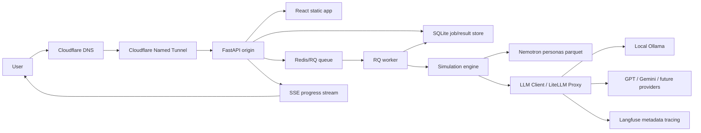

# KoreaSim

KoreaSim is a Korean AI human-behavior simulation product built on NVIDIA Nemotron-Personas-Korea, local Ollama inference, external LLM provider routing, and a React + FastAPI application surface.

## Current Decisions

- Public domain: `https://arabesque.cc`
- External demo stack: React frontend + FastAPI backend
- Legacy/internal surface: Streamlit may remain as an operator fallback, but is no longer the primary MVP surface
- Tunnel strategy: Cloudflare Named Tunnel to the FastAPI origin
- Auth strategy: Cloudflare Access allowlists are not part of the current demo target. The landing/status surface is public through Cloudflare Tunnel; `/app*`, `/results*`, and run/preset/export APIs require FastAPI Google OAuth when auth is configured. Test/staging E2E can use a disabled-by-default test-login endpoint.
- Launch quota strategy: authenticated new users receive 5 free simulation runs by default. Run creation is guarded server-side through SQLite user records and a usage ledger; admin/bypass emails can be configured by environment.
- Runtime persistence: SQLite job/result store
- Job execution: RQ worker backed by Redis
- Realtime progress: Server-Sent Events, with polling fallback
- Result trust layer: quality indicators, sample summary, seed, and disclaimer are part of the common result schema from the start
- LLM strategy: local Ollama first, provider-agnostic `LLMClient` boundary, then LiteLLM-based GPT/Gemini/Ollama routing with metadata observability
- Agentic intake strategy: natural-language goals are converted into structured slots, `IntakeContextEnvelope`, and `safe_intake_summary` before simulation execution.
- Data governance: full `raw_results` can be stored/returned in the protected product, but external provider and observability payloads default to minimal metadata

## Product Goal

Help Korean teams test product, pricing, marketing, and policy decisions before launch by simulating responses from Korean synthetic personas.

The first working demo should make one thing credible:

> A user can visit `arabesque.cc`, understand KoreaSim from the public landing page, enter the app at `/app`, run a Korean persona simulation, watch progress live, and inspect a trustworthy result with sample and quality context.

## Architecture



## Agent Flow

The agent system is intentionally split into two parts:

- Intake before the run: understand the user's goal, ask for missing information, and build safe structured input.
- Result agents after the run: analyze the completed aggregate result, write the report, and check the output.

```text
[사용자]
   |
   v
[무엇을 알고 싶은지 입력]
예: "가격을 얼마로 해야 할까요?"
    "캠페인 전략을 만들고 싶어요."
   |
   v
[입력 정리 단계]
- 사용자의 목표 파악
- 어떤 시뮬레이션이 맞는지 판단
- 부족한 정보 확인
   |
   v
[더 물어볼지 판단]
   |
   +--> 정보가 부족함
   |       |
   |       v
   |   [질문 1개만 하기]
   |   예: "어떤 제품인가요?"
   |
   +--> 여러 정보가 필요함
   |       |
   |       v
   |   [짧은 입력폼 보여주기]
   |
   +--> 후보가 필요함
   |       |
   |       v
   |   [문구/가격/채널 후보 만들기]
   |       |
   |       v
   |   [사용자에게 확인받기]
   |
   +--> 준비 완료
           |
           v
[실행용 입력 만들기]
- 사용자가 직접 말한 정보
- AI가 추론한 정보
- AI가 만든 후보
- 기본값
을 구분해서 저장
           |
           v
[시뮬레이션 실행]
           |
           v
[50~200명의 가상 한국인 페르소나에게 질문]
           |
           v
[응답 수집]
           |
           v
[결과 집계]
예:
- 어떤 선택지가 가장 많이 선택됐는지
- 연령/성별/지역별 차이가 있는지
- 응답 품질은 괜찮은지
           |
           v
[분석 AI]
- 숫자 결과를 해석
- 중요한 발견 정리
           |
           v
[리포트 AI]
- 사용자가 읽기 쉬운 보고서로 정리
- 추천 행동 제안
           |
           v
[검수 AI]
- 과장된 결론이 없는지 확인
- 표본이 작으면 "방향성 참고"로 표시
           |
           v
[최종 결과 저장]
           |
           v
[결과 화면에 표시]


중요한 원칙
--------------------------------------------------
1. 사용자가 말한 정보와 AI가 추론한 정보는 분리해서 저장합니다.

2. AI가 마음대로 가정한 내용은 결과에 몰래 섞지 않습니다.
   필요한 경우 사용자에게 먼저 확인받습니다.

3. 50~200명 응답 생성은 기존 방식 그대로 둡니다.
   이 부분을 복잡한 agent 구조로 바꾸지 않습니다.

4. Agent는 응답이 모두 끝난 뒤,
   결과를 해석하고 보고서를 만들고 검수하는 역할입니다.

5. Langfuse에는 민감한 원문 데이터가 아니라
   실행 상태, 모델 정보, 점수 같은 메타데이터만 보냅니다.
```

## Repository Map

```text
.
├── README.md
├── CLAUDE.md
├── app.py                         # Streamlit fallback, not primary external demo
├── frontend/                      # React/Vite UI
├── src/                           # Python simulation engine and shared modules
├── docs/
│   ├── prd.md
│   ├── data-spec.md
│   ├── design/
│   │   ├── react-fastapi-migration.md
│   │   ├── llm-gateway-orchestration.md
│   │   ├── harness-engineering-controls.md
│   │   ├── data-governance-and-io-boundary.md
│   │   └── evaluation-framework.md
│   ├── research/
│   │   ├── phase-1-implementation-readiness.md
│   │   └── harness-engineering-gap-review.md
│   ├── templates/
│   │   └── execution-plan-template.md
│   ├── execution/
│   │   ├── README.md
│   │   ├── phase-1-react-fastapi-rq-sqlite.md
│   │   ├── phase-2-stability-recovery.md
│   │   ├── phase-3-access-path-policy.md
│   │   ├── phase-4-demo-content-trust-layer.md
│   │   ├── phase-5-simulation-framework-price-optimization.md
│   │   ├── phase-6-design-sync.md
│   │   └── phase-7-llm-gateway-orchestration.md
│   ├── functional/
│   └── phases/
│       ├── phase-1-cloudflare-tunnel.md
│       ├── phase-2-stability.md
│       ├── phase-3-cloudflare-access.md
│       ├── phase-4-demo-content.md
│       ├── phase-5-simulations.md
│       ├── phase-6-design-sync.md
│       └── phase-7-llm-gateway-orchestration.md
└── pyproject.toml
```

## Roadmap

### Phase 0: Completed Core MVP

- Persona loader and sampler
- Ollama client
- Prompt builder
- Async batch simulator
- Creative Testing simulation
- Streamlit MVP smoke test
- React mock UI exists, but is not yet wired to the real engine

### Phase 1: React + FastAPI + Cloudflare Tunnel

- Create a FastAPI app that serves the React build and API routes from one origin
- Serve the existing React landing page publicly at `/`
- Serve the simulation app at `/app`
- Add minimum API contract for run creation, status, SSE progress, and result lookup
- Persist run state and results in SQLite from Phase 1
- Execute long-running runs through RQ + Redis
- Expose `arabesque.cc` through a Cloudflare Named Tunnel
- Keep Streamlit as a local fallback only

### Phase 2: Stability

- Harden SQLite-backed job/result persistence and recovery
- Add timeout and retry behavior for LLM calls
- Add SSE progress stream with polling fallback
- Preserve partial results and support browser refresh recovery

### Phase 3: Cloudflare Access / Public Route Decision

- Historical Access helper and policy documentation remain available for re-enabling a private demo.
- Current route policy keeps Cloudflare Access disabled and uses app-level auth for the application surface.
- Validate public landing/status paths with `scripts/check_public_external_demo.py`; validate login-backed app/API/SSE paths with agent-browser and test-login.

### Phase 4: Demo Content

- Add three polished enterprise-safe demo presets
- Add quick-start flow in React
- Add source, limitations, sample, and quality context in the result view

### Phase 5: Simulation Expansion

- All 9 simulation types are implemented with presets, API/RQ execution, shared result envelopes, renderer registry support, and live external Gemini 200-person validation.
- Price Optimization remains the reference implementation pattern for future simulation additions.
- V2 extensions such as clustering upgrades and advanced visualization should be added only after preserving schema parity and result-trust gates.

### Phase 6: Design Sync

- Keep `frontend/` and backend schema/API contracts synchronized
- Prevent mock-only UI drift
- Define when design changes require backend contract changes

### Phase 7: LLM Gateway and Agentic Orchestration

- Add provider-agnostic `LLMClient`
- Keep Ollama as local fallback
- Add LiteLLM model aliases for GPT/Gemini/Ollama routing
- Add metadata observability first
- Add LangGraph at the run-level orchestration boundary after the base lifecycle is stable
- Current live gate is complete for Gemini primary, LiteLLM alias scaffold, Langfuse metadata-only traces, task routing, run-level graph, and Ollama fallback boundary. Large local `gemma3:27b` validation remains environment-dependent.

## Engineering Method

1. Read the active phase document before editing.
2. For complex work, use the matching `docs/execution/<phase>.md` checklist before implementation.
3. Keep the public landing working at `arabesque.cc/` and the login-backed app working at `arabesque.cc/app`.
4. Prefer one origin for the external demo: FastAPI serves both API and React build.
5. Every simulation result must include reproducibility and trust context.
6. Do not hardcode provider model IDs inside simulation modules; use model aliases and the internal LLM client boundary.
7. Do not add a new simulation type before the shared run lifecycle is stable.
8. Update phase checkboxes and frontmatter dates when tasks are completed.
9. Keep Streamlit changes scoped to fallback/operator use unless explicitly re-promoted.

## Development Verification

Run the deterministic verification suite before handing work off or opening a PR:

```bash
uv run python scripts/verify.py
```

This currently runs:

- full-repository Python `ruff`
- deterministic Creative Testing fixture eval
- deterministic API result-envelope fixture eval
- `pytest` for deterministic backend/schema/store/worker/import-boundary tests
- backend active-scope coverage threshold at 85%
- backend schema to frontend TypeScript type parity tests
- frontend API result-envelope typed fixture contract
- frontend `eslint`
- frontend `typecheck`
- frontend production `build`

For a faster local loop:

```bash
uv run python scripts/verify.py --skip-build
```

## Local Integration Runbook

Gate 1F requires four local services/assets before a real 10/50-person run can pass:

1. Persona parquet exists at `data/nemotron_korea_personas.parquet`.
2. Redis is reachable at `REDIS_URL` (default `redis://localhost:6379/0`).
3. Ollama is reachable at `OLLAMA_BASE_URL` and has `MODEL` pulled.
4. React has been built into `frontend/dist`.

Check readiness:

```bash
uv run python scripts/check_local_services.py
```

Prepare data and frontend:

```bash
uv run python scripts/download_dataset.py
cd frontend && npm install && npm run build
```

Start local runtime processes in separate terminals:

```bash
redis-server
```

```bash
ollama serve
ollama pull gemma3:27b
```

```bash
uv run python scripts/run_worker.py
```

```bash
uv run uvicorn src.api.main:app --host 127.0.0.1 --port 8000
```

Validate:

```bash
curl http://127.0.0.1:8000/api/health
```

Then open `http://127.0.0.1:8000/app` and run Creative Testing with 10 people first, then 50.

Cloudflare Tunnel readiness:

```bash
uv run python scripts/check_cloudflare_tunnel.py
```

Expected tunnel target:

```yaml
ingress:
  - hostname: arabesque.cc
    service: http://localhost:8000
  - service: http_status:404
```

Before changing DNS, confirm in the Cloudflare dashboard that existing `arabesque.cc` apex records can be replaced or routed to this tunnel. Then create or reuse a Named Tunnel, route `arabesque.cc` to it, and run it against the FastAPI origin.

## Common API Contract

Initial endpoints:

```text
GET  /health
GET  /api/health
GET  /api/config
GET  /api/presets
POST /api/runs
GET  /api/runs/{run_id}
GET  /api/runs/{run_id}/events
GET  /api/runs/{run_id}/result
```

Initial run lifecycle:

```text
queued -> running -> completed
queued -> running -> failed
queued -> running -> canceled
```

Every result should include:

- `run_id`
- `simulation_type`
- `seed`
- `target_filter`
- `sample_summary`
- `quality`
- `warnings`
- `raw_results`
- simulation-specific metrics

## Key References

- Cloudflare Tunnel supports apex domains with Named Tunnels.
- Cloudflare Access can protect an apex domain or specific paths if a future private-demo requirement returns.
- Cloudflare DNS supports CNAME flattening at the zone apex.
- Data source: NVIDIA Nemotron-Personas-Korea, CC BY 4.0.
- Data governance: see `docs/design/data-governance-and-io-boundary.md`.
- Evaluation framework: see `docs/design/evaluation-framework.md`.
