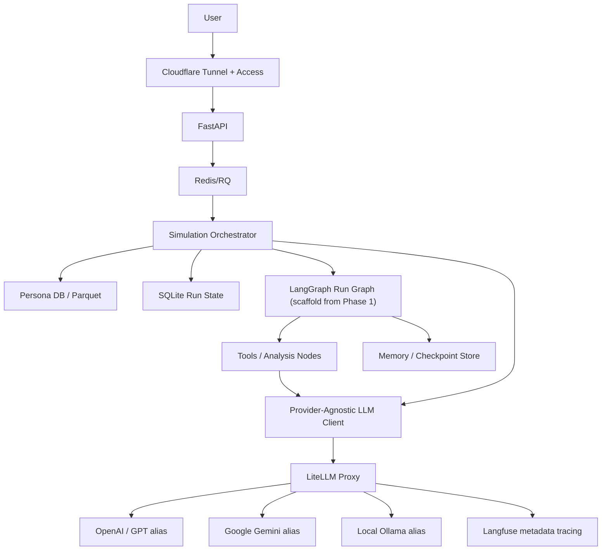

# LLM Gateway and Agentic Orchestration Design

## 1. Problem

Current implementation planning assumes local Ollama (`gemma3:27b`) as the only model backend. That is acceptable for early local validation, but it is not enough for production-quality demos or future customer PoCs.

KoreaSim needs:

- provider choice by task: GPT, Gemini, local Ollama, and future providers.
- model aliases controlled by config, not hardcoded in simulation modules.
- observability for cost, latency, errors, prompt quality, and output quality.
- a clean place to add agentic workflows without turning every simulation into ad hoc chains.
- state/memory that does not corrupt the base persona dataset.

## 2. Goals

- [ ] Introduce a provider-agnostic LLM gateway layer.
- [ ] Keep Ollama as local fallback and development backend.
- [ ] Support external model providers through configurable model aliases.
- [ ] Route different task classes to different model aliases.
- [ ] Add Langfuse observability without leaking API keys or operational secrets.
- [ ] Initialize LangGraph from Phase 1 as a run-level orchestration scaffold.
- [ ] Define memory/state boundaries before implementing long-term persona memory.

## 3. Non-goals

- Do not replace FastAPI/RQ/SQLite in the current migration.
- Do not make LangGraph responsible for every persona call in the first version.
- Do not introduce multiple LLM gateways in the initial architecture.
- Do not use Cloudflare AI Gateway in Phase 7; keep Cloudflare focused on Tunnel and Access.
- Do not mutate the 1M base persona dataset as “memory.”
- Do not expose provider keys to React.
- Do not require a single vendor for all model calls.

## 4. Recommended Architecture



### Why this shape

- FastAPI remains the product API boundary.
- RQ remains the long-running execution boundary.
- LiteLLM is the approved LLM gateway for Phase 7 because it can provide a unified OpenAI-compatible interface, routing, retries/fallbacks, budgets, and proxy deployment.
- Cloudflare remains the network/security layer for Tunnel and Access, not the LLM provider gateway.
- LangGraph should be initialized from Phase 1 but limited to run-level steps, not every persona call.
- Observability must be attached at the gateway and orchestration layers.

## 5. Gateway Boundary

There are two different “gateway” meanings:

1. External HTTP gateway:
   - Cloudflare Tunnel and Cloudflare Access.
   - Protects `/app*`, `/results*`, `/api*`.
   - Does not decide which LLM model to call.
2. LLM provider gateway:
   - LiteLLM Proxy.
   - Normalizes model calls, routing, retries, cost, and logs.
   - Must be server-side only.

For KoreaSim, keep these boundaries separate.

## 6. LLM Client Interface

Simulation modules should call an internal client interface, not provider SDKs directly.

```text
Simulation module
  -> LLMClient.generate(task_type, messages, response_schema, metadata)
  -> ModelRouter.resolve(task_type, simulation_type, requested_model_alias)
  -> GatewayClient.call(alias, messages, schema, metadata)
```

Initial task types:

- `persona_response`: high-volume per-persona response generation.
- `schema_repair`: cheap correction of malformed outputs.
- `aggregate_analysis`: higher-quality reasoning over aggregated metrics.
- `report_narrative`: user-facing result explanation.
- `qa_check`: checks overclaiming, missing caveats, and unsafe claims.
- `embedding`: optional later for segmentation or similarity.

## 7. Model Alias Strategy

Model names must not be scattered through code. Use aliases:

```yaml
models:
  persona_default: koresim/persona-fast
  persona_strong: koresim/persona-strong
  analysis_default: koresim/analysis-strong
  report_default: koresim/report-balanced
  schema_repair: koresim/repair-fast
  local_fallback: koresim/local-ollama
```

Example routing:

| Task | Default alias | Fallback alias | Notes |
| --- | --- | --- | --- |
| persona_response | `persona_default` | `local_fallback` | high volume, cost-sensitive |
| schema_repair | `schema_repair` | `local_fallback` | fast/cheap |
| aggregate_analysis | `analysis_default` | `persona_strong` | fewer calls, quality matters |
| report_narrative | `report_default` | `analysis_default` | user-visible |
| qa_check | `analysis_default` | `local_fallback` | trust/safety gate |

Actual provider model IDs are configured in LiteLLM, not hardcoded in simulation modules.

### First external provider

Gemini is the first external provider for KoreaSim. Keep provider model IDs inside LiteLLM configuration and expose only KoreaSim model aliases to product code.

The initial implementation may use Gemini's OpenAI-compatible endpoint directly through the internal `LLMClient` boundary for smoke testing. The product boundary stays the same; the longer-term gateway target remains LiteLLM Proxy so routing, fallback, budgets, and observability can move behind one control plane.

Initial alias intent:

| Alias | First provider target | Purpose |
| --- | --- | --- |
| `koresim/gemini-persona-strong` | Gemini fast/low-latency model | persona responses |
| `koresim/gemini-analysis` | Gemini stronger reasoning model | aggregate analysis |
| `koresim/gemini-report` | Gemini stronger reasoning model | user-facing report |
| `koresim/gemini-repair` | Gemini fast/low-latency model | schema repair |
| `koresim/local-ollama` | Ollama `gemma3:27b` | local fallback |

The exact Gemini model IDs can be adjusted after LiteLLM/Gemini availability is verified. Do not encode the provider model IDs in simulation modules.

## 8. LiteLLM Only for Phase 7

### Approved MVP

- FastAPI/RQ calls internal `LLMClient`.
- `LLMClient` calls LiteLLM Proxy through an OpenAI-compatible base URL.
- LiteLLM routes to OpenAI, Gemini, Ollama, or future providers.
- Langfuse callback records traces from LiteLLM.

### Explicit non-decision

Do not put Cloudflare AI Gateway in the initial model path. Mixing LiteLLM and Cloudflare AI Gateway duplicates routing, retry/fallback, logging, and cost attribution responsibilities. If a future production requirement needs Cloudflare-native AI Gateway, create a separate design doc and phase instead of adding it as an implicit hop.

## 9. LangGraph Scope

LangGraph is useful for durable, multi-step workflows. Initialize it from Phase 1 as a run-level scaffold so the codebase does not need a second orchestration migration later. Keep the first graph thin and reversible.

### Use LangGraph for run-level orchestration

Good first graph:

```text
validate_input
  -> sample_personas
  -> run_persona_batch
  -> aggregate_metrics
  -> analysis_agent
  -> report_agent
  -> qa_check
  -> persist_result
```

### Avoid LangGraph for first per-persona fanout

Running 50~200 persona calls as individual graph branches is possible but adds overhead before the product value is proven. Keep the existing async batch simulator for persona fanout first. Let LangGraph orchestrate the run as a whole.

## 10. Multi-Agent Plan

Add agents only where they improve result quality.

### Analysis agent

- reads metrics, segments, raw result samples.
- produces structured insights, caveats, and hypotheses.
- should not rewrite raw metrics.

### Report agent

- turns structured insights into user-facing report text.
- must cite the run metadata: sample size, model alias, seed, target filter.

### QA agent

- checks overclaiming, unsupported causal language, missing limitations, and inconsistent numbers.
- can block or downgrade result confidence.

### Optional research/tool agent

- later: fetch external benchmarks or customer-provided context.
- not part of MVP because KoreaSim’s first credibility point is the persona simulation itself.

## 11. Memory and State

Do not treat “long-term persona memory” as mutating the 1M base persona dataset.

Use three layers:

### Run state

- SQLite in the current MVP.
- Stores run status, events, partials, result envelopes, raw results.
- Retention: indefinite for local MVP.

### Project/session memory

- Stores user preferences, selected presets, previous runs, selected target filters.
- Useful for “compare with previous simulation” and returning users.
- Can remain SQLite initially.

### Scenario persona memory

- Optional and append-only.
- Stores simulation-specific scenario history for a synthetic persona in a project.
- Does not overwrite the base persona row.
- Example: “persona X was exposed to price 5,500 KRW in run A and rejected it.”

Implement scenario memory only after there is a clear product workflow that needs repeated exposure or longitudinal simulation.

## 12. Observability

Minimum events to trace:

- run id
- simulation type
- task type
- model alias and resolved provider model
- input token estimate, output token estimate, latency, error type
- retry/fallback path
- parse success/failure
- quality score and warning count

Approved first tool: Langfuse through LiteLLM callback.

Deferred alternatives:

- Helicone and LangSmith are not part of the Phase 7 default. Reconsider only if Langfuse does not cover the required tracing/debugging workflow.

Trace payload modes:

- `metadata_only`: log IDs, costs, latency, task type, no prompt/persona payload.
- `sampled_full`: log full prompt/result for a small sample of runs.
- `full_local`: full traces only in a self-hosted/local observability stack.

Because the MVP intentionally stores full `raw_results`, storage and observability policy must be separate. Full product result storage does not imply full third-party trace logging.

## 13. Configuration

Suggested environment variables:

```text
LLM_BACKEND=ollama|litellm
LLM_GATEWAY_BASE_URL=http://127.0.0.1:4000/v1
LLM_GATEWAY_API_KEY=...
GEMINI_API_KEY=...
MODEL_PERSONA_DEFAULT=koresim/persona-fast
MODEL_PERSONA_STRONG=koresim/persona-strong
MODEL_ANALYSIS_DEFAULT=koresim/analysis-strong
MODEL_REPORT_DEFAULT=koresim/report-balanced
MODEL_REPAIR_DEFAULT=koresim/repair-fast
MODEL_LOCAL_FALLBACK=koresim/local-ollama
LLM_TRACE_MODE=metadata_only|sampled_full|full_local
OBSERVABILITY_PROVIDER=none|langfuse
LANGFUSE_PUBLIC_KEY=...
LANGFUSE_SECRET_KEY=...
LANGFUSE_HOST=https://cloud.langfuse.com
```

## 14. Phasing

### Phase 1 compatibility

- Keep local Ollama working.
- Add an interface boundary so simulation modules do not hardcode Ollama forever.
- Initialize LangGraph run-level scaffold behind a config flag.
- Keep persona fanout in the existing async batch simulator.

### Phase 7.1 LLM provider abstraction

- Add `src/llm/base.py`, `src/llm/router.py`, provider adapters.
- Keep existing Ollama adapter.

### Phase 7.2 LiteLLM proxy

- Add local LiteLLM config.
- Add model aliases for persona, analysis, report, repair, local fallback.
- Validate one Creative Testing run through LiteLLM -> Ollama.

### Phase 7.3 External providers

- Add GPT/Gemini provider aliases.
- Validate small 10-person and 50-person runs.
- Compare latency, parse success, cost, and output quality.
- Apply [[data-governance-and-io-boundary]] before sending persona-derived prompt content to external providers.
- Apply [[evaluation-framework]] provider comparison evals before demo use.

### Phase 7.4 Observability

- Add Langfuse.
- Start with metadata-only tracing.
- Add sampled full traces after data policy is approved.

### Phase 7.5 LangGraph

- Expand the Phase 1 run-level graph around the existing batch simulator.
- Add analysis, report, and QA nodes.
- Keep RQ as the job execution boundary.

### Phase 7.6 Memory

- Add project/session memory first.
- Add scenario persona memory only when there is a repeated-run product requirement.

## 15. Risks

| Risk | Likelihood | Mitigation |
| --- | --- | --- |
| Too many gateway layers | High | Use LiteLLM only in Phase 7; do not mix Cloudflare AI Gateway |
| Cost explosion from 200-person runs | High | model aliases, budgets, max sample size, metadata-only tracing |
| Provider-specific behavior leaks into simulation code | Medium | internal LLMClient and model aliases |
| LangGraph overcomplicates batch fanout | Medium | initialize run-level graph only; keep existing async batch for persona calls |
| Observability leaks too much prompt/persona data | Medium | trace payload modes and metadata-only default |
| Persona memory corrupts base dataset | Medium | append-only scenario memory, never mutate base personas |

## 16. Acceptance Criteria

- [ ] Ollama local path still works.
- [ ] LiteLLM path works with the same simulation code.
- [ ] model aliases can switch provider/model without code changes.
- [ ] one external provider run completes locally with 10 personas.
- [ ] one external provider run completes locally with 50 personas.
- [ ] trace includes model alias, provider, latency, error, cost estimate, and parse success.
- [ ] full raw result storage remains separate from third-party trace payload policy.
- [ ] LangGraph run-level scaffold exists from Phase 1 and does not replace persona fanout.

## 17. Resolved Decisions

{ 결정: 첫 LLM gateway는 LiteLLM Proxy로 고정한다.
이유: 모델 alias, local Ollama, GPT/Gemini routing, fallback, budget, Langfuse 연동을 한 control plane에서 처리한다. Cloudflare AI Gateway와 섞으면 routing/fallback/logging 책임이 중복된다. }

{ 결정: 관측성 도구는 Langfuse로 시작한다.
이유: LiteLLM Proxy와 조합이 좋고, self-host 가능성이 있어 raw/persona 데이터 정책을 통제하기 쉽습니다. }

{ 결정: 첫 외부 provider는 Gemini API로 시작한다.
이유: 사용자가 Gemini 우선 적용을 결정했다. KoreaSim product code는 Gemini SDK나 provider model id를 직접 참조하지 않고 LiteLLM model alias만 사용한다. }

{ 결정: LangGraph는 Phase 1부터 init한다.
이유: 나중에 orchestration migration을 다시 하지 않기 위해 run-level graph scaffold를 먼저 둡니다. 단, 50~200명 persona fanout은 기존 async batch를 유지합니다. }

{ 결정: observability payload는 metadata-only로 시작한다.
이유: 제품 저장소에는 full raw를 유지하되, 외부 관측성에는 기본적으로 metadata만 보내는 것이 안전합니다. sampled full trace는 별도 승인 후 켭니다. }

{ 결정: 외부 provider 전송 정책은 [[data-governance-and-io-boundary]]를 따른다.
이유: full raw result를 제품 저장소에 보관하는 것과 GPT/Gemini/Langfuse 같은 외부 서비스로 prompt/persona payload를 보내는 것은 별도 정책이어야 합니다. }

## 18. References

- [LiteLLM docs](https://docs.litellm.ai/)
- [LangGraph durable execution](https://docs.langchain.com/oss/python/langgraph/durable-execution)
- [Langfuse observability](https://langfuse.com/docs/observability/overview)
- [Langfuse LiteLLM integration](https://langfuse.com/integrations/gateways/litellm)
- [LangSmith observability](https://docs.langchain.com/oss/python/langgraph/observability)
